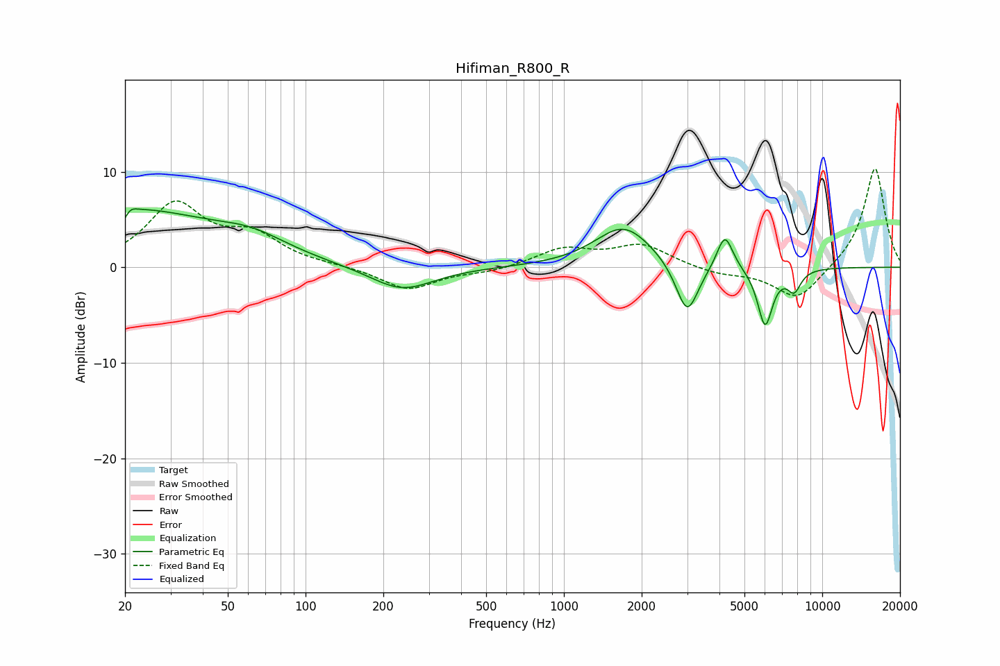

# Hifiman_R800_R
See [usage instructions](https://github.com/jaakkopasanen/AutoEq#usage) for more options and info.

### Parametric EQs
Apply preamp of -6.2 dB when using parametric equalizer.

|   # | Type    |   Fc (Hz) |    Q |   Gain (dB) |
|-----|---------|-----------|------|-------------|
|   1 | Peaking |        20 | 0.4  |         6   |
|   2 | Peaking |        20 | 5.87 |        -4.1 |
|   3 | Peaking |        20 | 5.87 |         3.3 |
|   4 | Peaking |        62 | 1.04 |         1.6 |
|   5 | Peaking |       236 | 1.15 |        -2.6 |
|   6 | Peaking |      1706 | 1.27 |         4.4 |
|   7 | Peaking |      3000 | 3.2  |        -5.6 |
|   8 | Peaking |      4199 | 4.52 |         3.8 |
|   9 | Peaking |      6010 | 4.68 |        -6.1 |
|  10 | Peaking |      7784 | 5.03 |        -2.1 |

### Fixed Band EQs
When using fixed band (also called graphic) equalizer, apply preamp of **-10.4 dB** (if available) and set gains manually with these parameters.

|   # | Type    |   Fc (Hz) |    Q |   Gain (dB) |
|-----|---------|-----------|------|-------------|
|   1 | Peaking |        31 | 1.41 |         6.4 |
|   2 | Peaking |        62 | 1.41 |         2.9 |
|   3 | Peaking |       125 | 1.41 |         0.1 |
|   4 | Peaking |       250 | 1.41 |        -2.4 |
|   5 | Peaking |       500 | 1.41 |        -0.5 |
|   6 | Peaking |      1000 | 1.41 |         1.9 |
|   7 | Peaking |      2000 | 1.41 |         2.3 |
|   8 | Peaking |      4000 | 1.41 |        -0.7 |
|   9 | Peaking |      8000 | 1.41 |        -3.5 |
|  10 | Peaking |     16000 | 1.41 |        10.5 |

### Graphs

