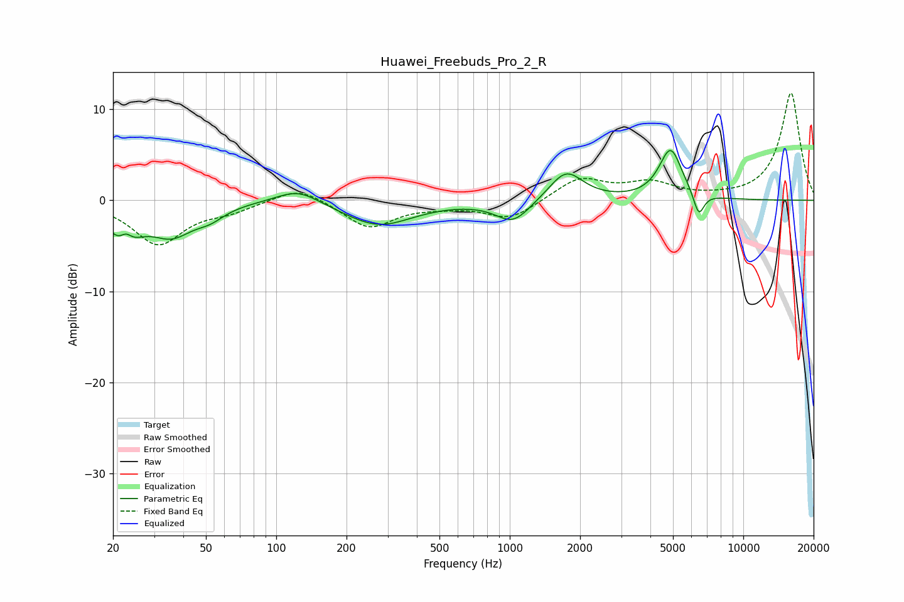

# Huawei_Freebuds_Pro_2_R
See [usage instructions](https://github.com/jaakkopasanen/AutoEq#usage) for more options and info.

### Parametric EQs
Apply preamp of -5.6 dB when using parametric equalizer.

|   # | Type    |   Fc (Hz) |    Q |   Gain (dB) |
|-----|---------|-----------|------|-------------|
|   1 | Peaking |        22 | 2.18 |        -4.2 |
|   2 | Peaking |        23 | 5.32 |         1.6 |
|   3 | Peaking |        36 | 1.56 |        -3.3 |
|   4 | Peaking |        52 | 2.22 |        -1.2 |
|   5 | Peaking |       124 | 1.52 |         1.7 |
|   6 | Peaking |       274 | 0.96 |        -2.8 |
|   7 | Peaking |      1034 | 1.92 |        -2.5 |
|   8 | Peaking |      1742 | 1.96 |         3.3 |
|   9 | Peaking |      4881 | 2.86 |         5.6 |
|  10 | Peaking |      6445 | 6    |        -2.6 |

### Fixed Band EQs
When using fixed band (also called graphic) equalizer, apply preamp of **-11.9 dB** (if available) and set gains manually with these parameters.

|   # | Type    |   Fc (Hz) |    Q |   Gain (dB) |
|-----|---------|-----------|------|-------------|
|   1 | Peaking |        31 | 1.41 |        -4.7 |
|   2 | Peaking |        62 | 1.41 |        -1   |
|   3 | Peaking |       125 | 1.41 |         1.7 |
|   4 | Peaking |       250 | 1.41 |        -3   |
|   5 | Peaking |       500 | 1.41 |        -0.4 |
|   6 | Peaking |      1000 | 1.41 |        -2.1 |
|   7 | Peaking |      2000 | 1.41 |         2.4 |
|   8 | Peaking |      4000 | 1.41 |         1.7 |
|   9 | Peaking |      8000 | 1.41 |         0.1 |
|  10 | Peaking |     16000 | 1.41 |        11.8 |

### Graphs

