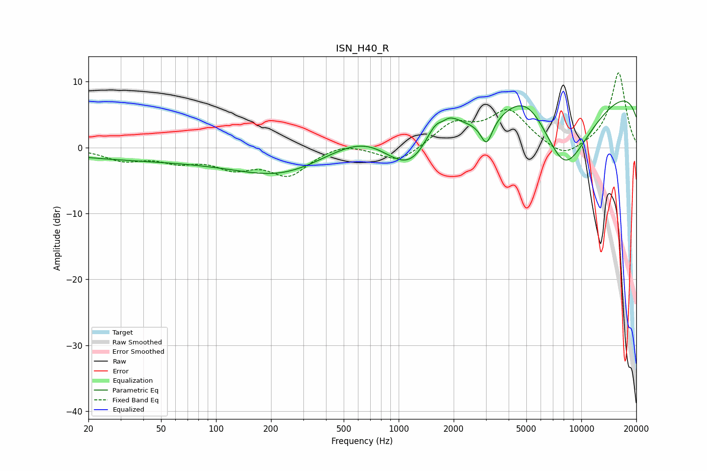

# ISN_H40_R
See [usage instructions](https://github.com/jaakkopasanen/AutoEq#usage) for more options and info.

### Parametric EQs
Apply preamp of -7.1 dB when using parametric equalizer.

|   # | Type    |   Fc (Hz) |    Q |   Gain (dB) |
|-----|---------|-----------|------|-------------|
|   1 | Peaking |        68 | 0.19 |        -2   |
|   2 | Peaking |       236 | 0.6  |        -3   |
|   3 | Peaking |       706 | 0.64 |         6.2 |
|   4 | Peaking |      1214 | 0.67 |       -11.9 |
|   5 | Peaking |      1690 | 1.41 |         8.6 |
|   6 | Peaking |      1739 | 4.95 |        -1.1 |
|   7 | Peaking |      3029 | 4.32 |        -3.9 |
|   8 | Peaking |      5043 | 0.97 |         6.7 |
|   9 | Peaking |      8037 | 0.58 |       -19.1 |
|  10 | Peaking |     10000 | 0.18 |        14.9 |

### Fixed Band EQs
When using fixed band (also called graphic) equalizer, apply preamp of **-11.4 dB** (if available) and set gains manually with these parameters.

|   # | Type    |   Fc (Hz) |    Q |   Gain (dB) |
|-----|---------|-----------|------|-------------|
|   1 | Peaking |        31 | 1.41 |        -1.8 |
|   2 | Peaking |        62 | 1.41 |        -1.8 |
|   3 | Peaking |       125 | 1.41 |        -2.6 |
|   4 | Peaking |       250 | 1.41 |        -3.9 |
|   5 | Peaking |       500 | 1.41 |         0.9 |
|   6 | Peaking |      1000 | 1.41 |        -2.4 |
|   7 | Peaking |      2000 | 1.41 |         3.5 |
|   8 | Peaking |      4000 | 1.41 |         5.4 |
|   9 | Peaking |      8000 | 1.41 |        -2   |
|  10 | Peaking |     16000 | 1.41 |        11.4 |

### Graphs

