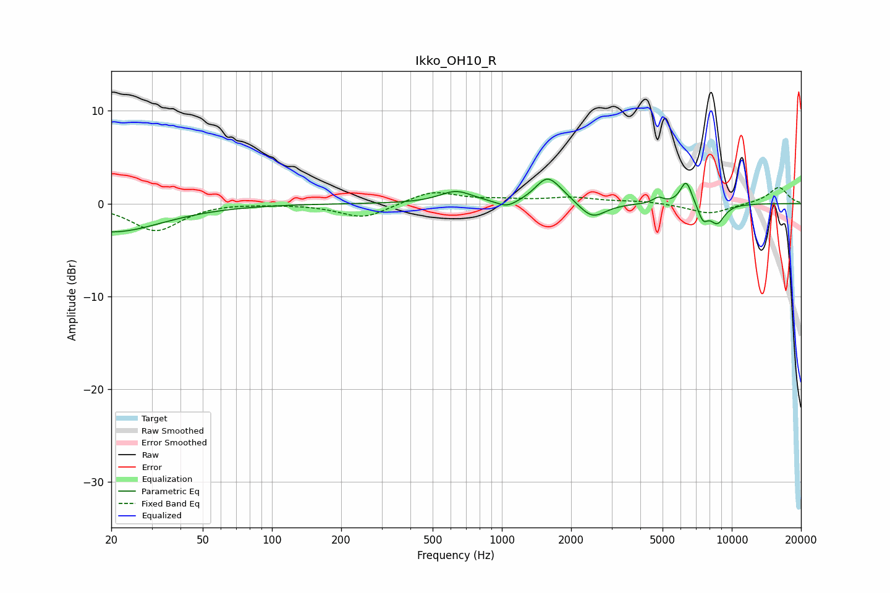

# Ikko_OH10_R
See [usage instructions](https://github.com/jaakkopasanen/AutoEq#usage) for more options and info.

### Parametric EQs
Apply preamp of -2.7 dB when using parametric equalizer.

|   # | Type    |   Fc (Hz) |    Q |   Gain (dB) |
|-----|---------|-----------|------|-------------|
|   1 | Peaking |        20 | 0.65 |        -3.1 |
|   2 | Peaking |       632 | 1.98 |         1.3 |
|   3 | Peaking |      1052 | 3.09 |        -0.8 |
|   4 | Peaking |      1569 | 2.78 |         2.4 |
|   5 | Peaking |      1797 | 2.28 |         0.7 |
|   6 | Peaking |      2472 | 2.48 |        -1.7 |
|   7 | Peaking |      4785 | 6    |         0.6 |
|   8 | Peaking |      6332 | 5.36 |         2.6 |
|   9 | Peaking |      7498 | 5.99 |        -1.6 |
|  10 | Peaking |      8646 | 3.88 |        -2   |

### Fixed Band EQs
When using fixed band (also called graphic) equalizer, apply preamp of **-1.8 dB** (if available) and set gains manually with these parameters.

|   # | Type    |   Fc (Hz) |    Q |   Gain (dB) |
|-----|---------|-----------|------|-------------|
|   1 | Peaking |        31 | 1.41 |        -2.9 |
|   2 | Peaking |        62 | 1.41 |         0.1 |
|   3 | Peaking |       125 | 1.41 |        -0   |
|   4 | Peaking |       250 | 1.41 |        -1.6 |
|   5 | Peaking |       500 | 1.41 |         1.4 |
|   6 | Peaking |      1000 | 1.41 |         0.3 |
|   7 | Peaking |      2000 | 1.41 |         0.6 |
|   8 | Peaking |      4000 | 1.41 |         0.3 |
|   9 | Peaking |      8000 | 1.41 |        -1.1 |
|  10 | Peaking |     16000 | 1.41 |         1.8 |

### Graphs

