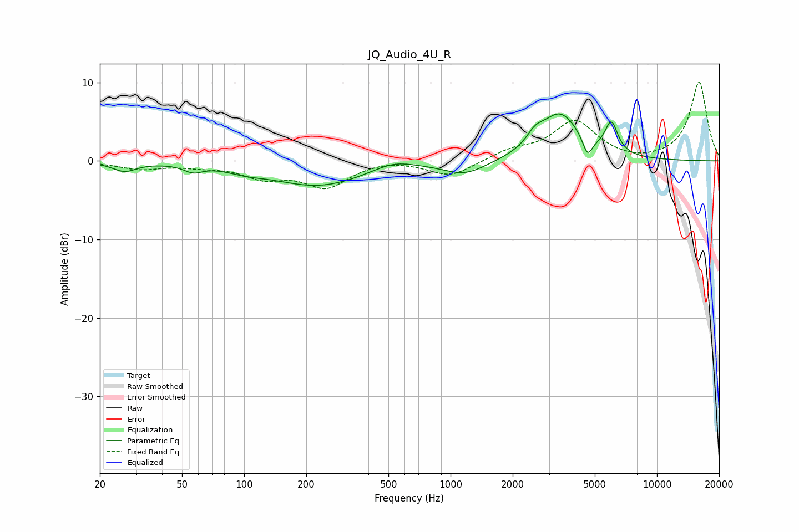

# JQ_Audio_4U_R
See [usage instructions](https://github.com/jaakkopasanen/AutoEq#usage) for more options and info.

### Parametric EQs
Apply preamp of -6.1 dB when using parametric equalizer.

|   # | Type    |   Fc (Hz) |    Q |   Gain (dB) |
|-----|---------|-----------|------|-------------|
|   1 | Peaking |        26 | 2.46 |        -1.2 |
|   2 | Peaking |        57 | 3.22 |        -0.9 |
|   3 | Peaking |       102 | 1.65 |        -0.5 |
|   4 | Peaking |       229 | 0.62 |        -3.1 |
|   5 | Peaking |       528 | 1.42 |         1.1 |
|   6 | Peaking |      1178 | 1.35 |        -1.7 |
|   7 | Peaking |      2566 | 3.49 |         1.4 |
|   8 | Peaking |      3390 | 1.48 |         5.9 |
|   9 | Peaking |      4609 | 6    |        -2.4 |
|  10 | Peaking |      6013 | 4.49 |         3.9 |

### Fixed Band EQs
When using fixed band (also called graphic) equalizer, apply preamp of **-10.1 dB** (if available) and set gains manually with these parameters.

|   # | Type    |   Fc (Hz) |    Q |   Gain (dB) |
|-----|---------|-----------|------|-------------|
|   1 | Peaking |        31 | 1.41 |        -0.9 |
|   2 | Peaking |        62 | 1.41 |        -0.5 |
|   3 | Peaking |       125 | 1.41 |        -1.9 |
|   4 | Peaking |       250 | 1.41 |        -3.2 |
|   5 | Peaking |       500 | 1.41 |         0.3 |
|   6 | Peaking |      1000 | 1.41 |        -2   |
|   7 | Peaking |      2000 | 1.41 |         1.2 |
|   8 | Peaking |      4000 | 1.41 |         5   |
|   9 | Peaking |      8000 | 1.41 |        -0.3 |
|  10 | Peaking |     16000 | 1.41 |        10.1 |

### Graphs

