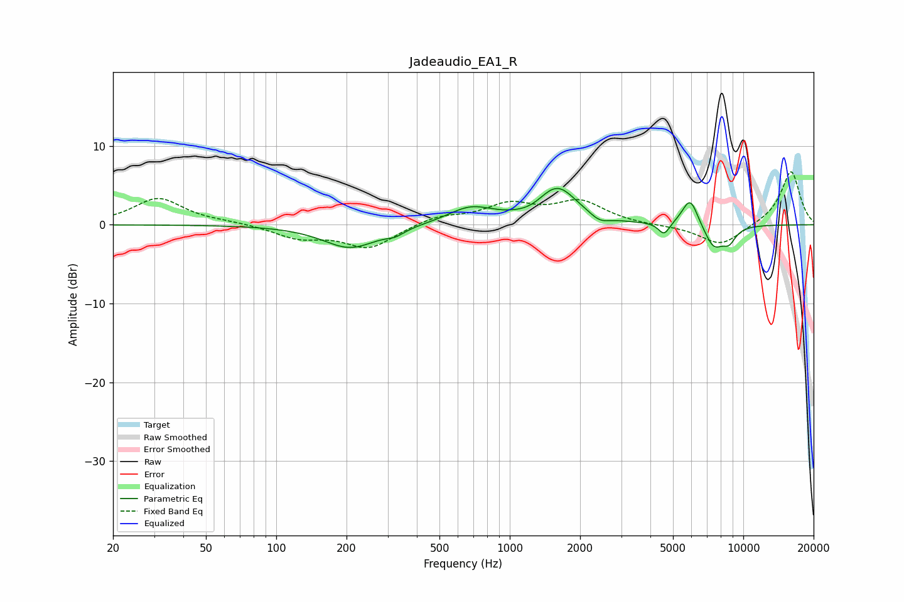

# Jadeaudio_EA1_R
See [usage instructions](https://github.com/jaakkopasanen/AutoEq#usage) for more options and info.

### Parametric EQs
Apply preamp of -4.7 dB when using parametric equalizer.

|   # | Type    |   Fc (Hz) |    Q |   Gain (dB) |
|-----|---------|-----------|------|-------------|
|   1 | Peaking |       208 | 1.21 |        -3   |
|   2 | Peaking |       323 | 3.66 |        -0.6 |
|   3 | Peaking |       679 | 1.42 |         2.1 |
|   4 | Peaking |      1233 | 2.61 |        -0.4 |
|   5 | Peaking |      1600 | 1.69 |         4.6 |
|   6 | Peaking |      2427 | 3.56 |        -0.9 |
|   7 | Peaking |      4582 | 5.8  |        -1.6 |
|   8 | Peaking |      5921 | 3.98 |         3.6 |
|   9 | Peaking |      7468 | 3.21 |        -2.9 |
|  10 | Peaking |      8686 | 4.3  |        -1.7 |

### Fixed Band EQs
When using fixed band (also called graphic) equalizer, apply preamp of **-6.8 dB** (if available) and set gains manually with these parameters.

|   # | Type    |   Fc (Hz) |    Q |   Gain (dB) |
|-----|---------|-----------|------|-------------|
|   1 | Peaking |        31 | 1.41 |         3.4 |
|   2 | Peaking |        62 | 1.41 |         0.3 |
|   3 | Peaking |       125 | 1.41 |        -1.6 |
|   4 | Peaking |       250 | 1.41 |        -2.9 |
|   5 | Peaking |       500 | 1.41 |         1.1 |
|   6 | Peaking |      1000 | 1.41 |         2.4 |
|   7 | Peaking |      2000 | 1.41 |         2.8 |
|   8 | Peaking |      4000 | 1.41 |        -0.1 |
|   9 | Peaking |      8000 | 1.41 |        -2.7 |
|  10 | Peaking |     16000 | 1.41 |         6.9 |

### Graphs

