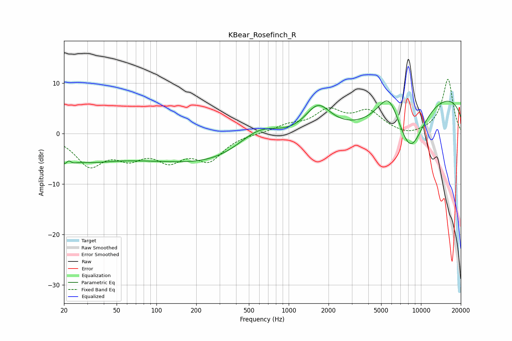

# KBear_Rosefinch_R
See [usage instructions](https://github.com/jaakkopasanen/AutoEq#usage) for more options and info.

### Parametric EQs
Apply preamp of -6.6 dB when using parametric equalizer.

|   # | Type    |   Fc (Hz) |    Q |   Gain (dB) |
|-----|---------|-----------|------|-------------|
|   1 | Peaking |        21 | 3.52 |        -4.6 |
|   2 | Peaking |        22 | 5.97 |         2.9 |
|   3 | Peaking |        30 | 0.9  |        -2   |
|   4 | Peaking |       124 | 0.18 |        -4.8 |
|   5 | Peaking |       601 | 0.73 |         6.5 |
|   6 | Peaking |      1002 | 0.22 |        -4.6 |
|   7 | Peaking |      1663 | 1.36 |         6.3 |
|   8 | Peaking |      5722 | 1.55 |         7.4 |
|   9 | Peaking |      8264 | 0.65 |       -20   |
|  10 | Peaking |      9783 | 0.25 |        16.7 |

### Fixed Band EQs
When using fixed band (also called graphic) equalizer, apply preamp of **-10.9 dB** (if available) and set gains manually with these parameters.

|   # | Type    |   Fc (Hz) |    Q |   Gain (dB) |
|-----|---------|-----------|------|-------------|
|   1 | Peaking |        31 | 1.41 |        -5.9 |
|   2 | Peaking |        62 | 1.41 |        -3.7 |
|   3 | Peaking |       125 | 1.41 |        -4.4 |
|   4 | Peaking |       250 | 1.41 |        -4.8 |
|   5 | Peaking |       500 | 1.41 |         0.1 |
|   6 | Peaking |      1000 | 1.41 |         1.4 |
|   7 | Peaking |      2000 | 1.41 |         4.2 |
|   8 | Peaking |      4000 | 1.41 |         4   |
|   9 | Peaking |      8000 | 1.41 |        -0.8 |
|  10 | Peaking |     16000 | 1.41 |        10.8 |

### Graphs

