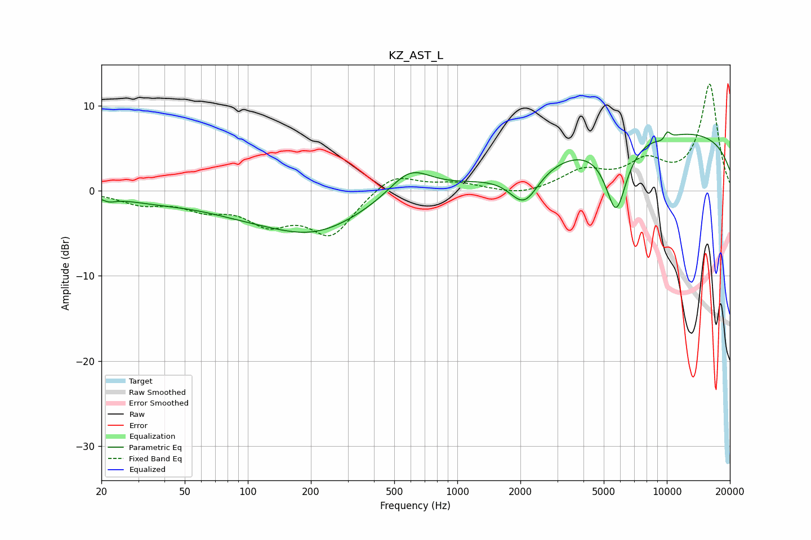

# KZ_AST_L
See [usage instructions](https://github.com/jaakkopasanen/AutoEq#usage) for more options and info.

### Parametric EQs
Apply preamp of -7.0 dB when using parametric equalizer.

|   # | Type    |   Fc (Hz) |    Q |   Gain (dB) |
|-----|---------|-----------|------|-------------|
|   1 | Peaking |        22 | 4.4  |        -0.5 |
|   2 | Peaking |        36 | 0.73 |        -0.8 |
|   3 | Peaking |        89 | 0.67 |        -1.2 |
|   4 | Peaking |       208 | 0.58 |        -4.6 |
|   5 | Peaking |       593 | 1.42 |         3.2 |
|   6 | Peaking |      2085 | 1.97 |        -4.3 |
|   7 | Peaking |      5727 | 2.67 |        -8.3 |
|   8 | Peaking |      9886 | 4.35 |        -2   |
|   9 | Peaking |     10000 | 0.18 |         7.1 |
|  10 | Peaking |     10000 | 6    |         2.4 |

### Fixed Band EQs
When using fixed band (also called graphic) equalizer, apply preamp of **-12.6 dB** (if available) and set gains manually with these parameters.

|   # | Type    |   Fc (Hz) |    Q |   Gain (dB) |
|-----|---------|-----------|------|-------------|
|   1 | Peaking |        31 | 1.41 |        -1.4 |
|   2 | Peaking |        62 | 1.41 |        -1.7 |
|   3 | Peaking |       125 | 1.41 |        -3.3 |
|   4 | Peaking |       250 | 1.41 |        -5   |
|   5 | Peaking |       500 | 1.41 |         2.2 |
|   6 | Peaking |      1000 | 1.41 |         0.8 |
|   7 | Peaking |      2000 | 1.41 |        -0.7 |
|   8 | Peaking |      4000 | 1.41 |         2.2 |
|   9 | Peaking |      8000 | 1.41 |         3   |
|  10 | Peaking |     16000 | 1.41 |        12.5 |

### Graphs

