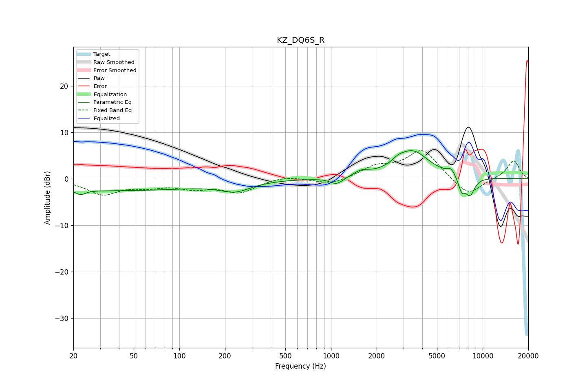

# KZ_DQ6S_R
See [usage instructions](https://github.com/jaakkopasanen/AutoEq#usage) for more options and info.

### Parametric EQs
Apply preamp of -6.1 dB when using parametric equalizer.

|   # | Type    |   Fc (Hz) |    Q |   Gain (dB) |
|-----|---------|-----------|------|-------------|
|   1 | Peaking |        22 | 5.01 |        -0.9 |
|   2 | Peaking |        33 | 0.18 |        -2.5 |
|   3 | Peaking |       234 | 1.45 |        -1.9 |
|   4 | Peaking |      1090 | 3.28 |        -1.5 |
|   5 | Peaking |      1584 | 2.78 |         1.1 |
|   6 | Peaking |      2765 | 3.84 |         0.7 |
|   7 | Peaking |      3435 | 1.26 |         5.9 |
|   8 | Peaking |      6185 | 5.14 |         1.4 |
|   9 | Peaking |      7276 | 6    |        -2.9 |
|  10 | Peaking |      8256 | 4.13 |        -3.8 |

### Fixed Band EQs
When using fixed band (also called graphic) equalizer, apply preamp of **-6.1 dB** (if available) and set gains manually with these parameters.

|   # | Type    |   Fc (Hz) |    Q |   Gain (dB) |
|-----|---------|-----------|------|-------------|
|   1 | Peaking |        31 | 1.41 |        -3.2 |
|   2 | Peaking |        62 | 1.41 |        -1.3 |
|   3 | Peaking |       125 | 1.41 |        -1.7 |
|   4 | Peaking |       250 | 1.41 |        -2.8 |
|   5 | Peaking |       500 | 1.41 |         0.7 |
|   6 | Peaking |      1000 | 1.41 |        -1.3 |
|   7 | Peaking |      2000 | 1.41 |         2.3 |
|   8 | Peaking |      4000 | 1.41 |         6.2 |
|   9 | Peaking |      8000 | 1.41 |        -3.9 |
|  10 | Peaking |     16000 | 1.41 |         4   |

### Graphs

