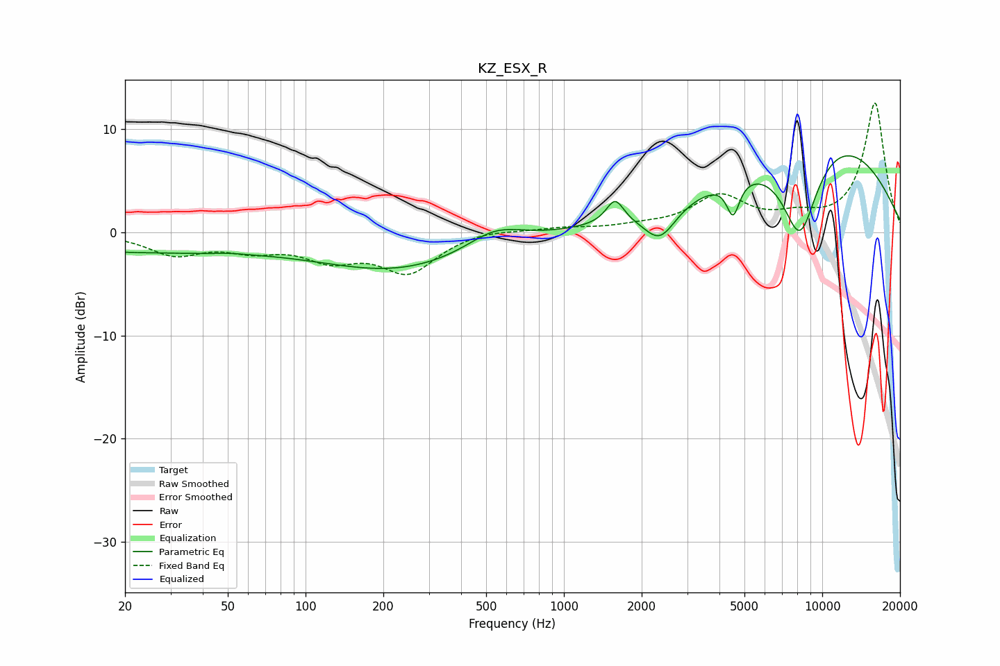

# KZ_ESX_R
See [usage instructions](https://github.com/jaakkopasanen/AutoEq#usage) for more options and info.

### Parametric EQs
Apply preamp of -7.5 dB when using parametric equalizer.

|   # | Type    |   Fc (Hz) |    Q |   Gain (dB) |
|-----|---------|-----------|------|-------------|
|   1 | Peaking |        22 | 0.28 |        -1.8 |
|   2 | Peaking |        27 | 5.4  |         0   |
|   3 | Peaking |        51 | 2.99 |         0.1 |
|   4 | Peaking |       229 | 0.45 |        -3.5 |
|   5 | Peaking |       540 | 1.29 |         1.9 |
|   6 | Peaking |      1578 | 4.2  |         2.3 |
|   7 | Peaking |      2352 | 2.28 |        -3.2 |
|   8 | Peaking |      4518 | 5.67 |        -3.3 |
|   9 | Peaking |      8193 | 1.76 |        -9.5 |
|  10 | Peaking |      9518 | 0.34 |        10.1 |

### Fixed Band EQs
When using fixed band (also called graphic) equalizer, apply preamp of **-12.6 dB** (if available) and set gains manually with these parameters.

|   # | Type    |   Fc (Hz) |    Q |   Gain (dB) |
|-----|---------|-----------|------|-------------|
|   1 | Peaking |        31 | 1.41 |        -2   |
|   2 | Peaking |        62 | 1.41 |        -1.4 |
|   3 | Peaking |       125 | 1.41 |        -2.2 |
|   4 | Peaking |       250 | 1.41 |        -3.7 |
|   5 | Peaking |       500 | 1.41 |         0.4 |
|   6 | Peaking |      1000 | 1.41 |         0.4 |
|   7 | Peaking |      2000 | 1.41 |         0.4 |
|   8 | Peaking |      4000 | 1.41 |         3.3 |
|   9 | Peaking |      8000 | 1.41 |         1.1 |
|  10 | Peaking |     16000 | 1.41 |        12.5 |

### Graphs

