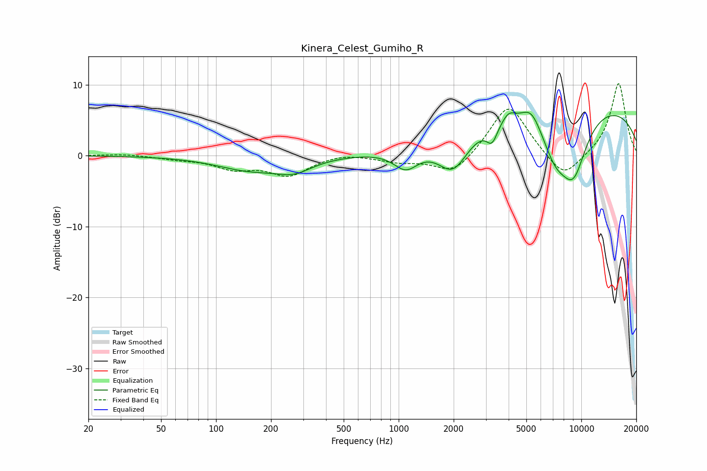

# Kinera_Celest_Gumiho_R
See [usage instructions](https://github.com/jaakkopasanen/AutoEq#usage) for more options and info.

### Parametric EQs
Apply preamp of -6.2 dB when using parametric equalizer.

|   # | Type    |   Fc (Hz) |    Q |   Gain (dB) |
|-----|---------|-----------|------|-------------|
|   1 | Peaking |       153 | 0.77 |        -1.9 |
|   2 | Peaking |       268 | 1.42 |        -1.7 |
|   3 | Peaking |      1096 | 2.06 |        -2.9 |
|   4 | Peaking |      1988 | 1.63 |        -5.4 |
|   5 | Peaking |      3246 | 4.72 |        -2.5 |
|   6 | Peaking |      3996 | 4    |         1.3 |
|   7 | Peaking |      5321 | 2.62 |         2.5 |
|   8 | Peaking |      7182 | 1.72 |        -5.1 |
|   9 | Peaking |      8820 | 0.18 |         7.8 |
|  10 | Peaking |      9052 | 1.61 |        -8.5 |

### Fixed Band EQs
When using fixed band (also called graphic) equalizer, apply preamp of **-10.2 dB** (if available) and set gains manually with these parameters.

|   # | Type    |   Fc (Hz) |    Q |   Gain (dB) |
|-----|---------|-----------|------|-------------|
|   1 | Peaking |        31 | 1.41 |         0.2 |
|   2 | Peaking |        62 | 1.41 |        -0.4 |
|   3 | Peaking |       125 | 1.41 |        -1.6 |
|   4 | Peaking |       250 | 1.41 |        -2.7 |
|   5 | Peaking |       500 | 1.41 |         0.5 |
|   6 | Peaking |      1000 | 1.41 |        -0.8 |
|   7 | Peaking |      2000 | 1.41 |        -2.8 |
|   8 | Peaking |      4000 | 1.41 |         7.5 |
|   9 | Peaking |      8000 | 1.41 |        -3.7 |
|  10 | Peaking |     16000 | 1.41 |        10.3 |

### Graphs

