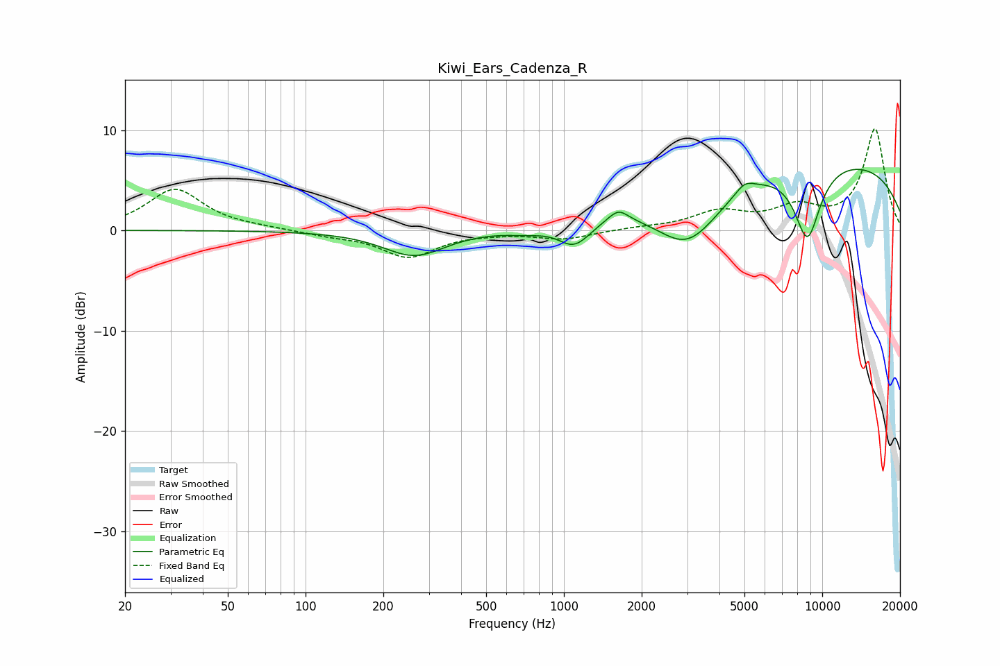

# Kiwi_Ears_Cadenza_R
See [usage instructions](https://github.com/jaakkopasanen/AutoEq#usage) for more options and info.

### Parametric EQs
Apply preamp of -6.2 dB when using parametric equalizer.

|   # | Type    |   Fc (Hz) |    Q |   Gain (dB) |
|-----|---------|-----------|------|-------------|
|   1 | Peaking |       264 | 1.18 |        -2.6 |
|   2 | Peaking |       722 | 1.62 |        -0.5 |
|   3 | Peaking |      1086 | 2.39 |        -2.2 |
|   4 | Peaking |      1219 | 2.82 |        -0.3 |
|   5 | Peaking |      1625 | 3.77 |         1.2 |
|   6 | Peaking |      3020 | 1.04 |        -6.4 |
|   7 | Peaking |      5007 | 3.86 |         1   |
|   8 | Peaking |      8555 | 0.18 |         7.4 |
|   9 | Peaking |      8772 | 2.45 |        -7.5 |
|  10 | Peaking |      9447 | 3.4  |         0.2 |

### Fixed Band EQs
When using fixed band (also called graphic) equalizer, apply preamp of **-10.2 dB** (if available) and set gains manually with these parameters.

|   # | Type    |   Fc (Hz) |    Q |   Gain (dB) |
|-----|---------|-----------|------|-------------|
|   1 | Peaking |        31 | 1.41 |         4.1 |
|   2 | Peaking |        62 | 1.41 |         0.2 |
|   3 | Peaking |       125 | 1.41 |        -0.4 |
|   4 | Peaking |       250 | 1.41 |        -2.6 |
|   5 | Peaking |       500 | 1.41 |        -0.1 |
|   6 | Peaking |      1000 | 1.41 |        -0.8 |
|   7 | Peaking |      2000 | 1.41 |         0.2 |
|   8 | Peaking |      4000 | 1.41 |         1.7 |
|   9 | Peaking |      8000 | 1.41 |         2   |
|  10 | Peaking |     16000 | 1.41 |        10.1 |

### Graphs

