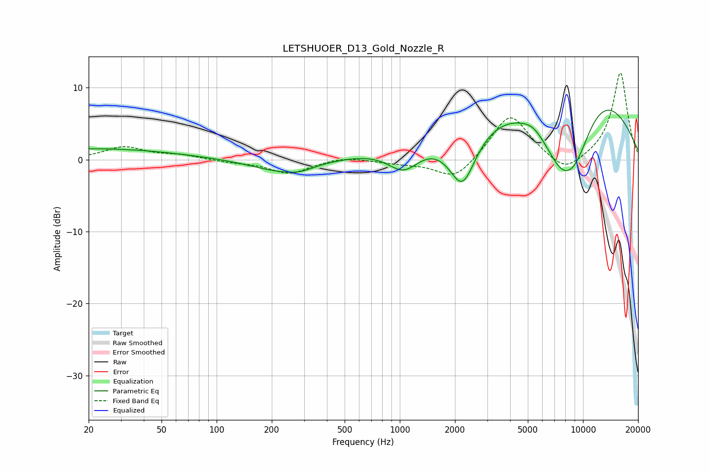

# LETSHUOER_D13_Gold_Nozzle_R
See [usage instructions](https://github.com/jaakkopasanen/AutoEq#usage) for more options and info.

### Parametric EQs
Apply preamp of -7.0 dB when using parametric equalizer.

|   # | Type    |   Fc (Hz) |    Q |   Gain (dB) |
|-----|---------|-----------|------|-------------|
|   1 | Peaking |        21 | 0.3  |         1.5 |
|   2 | Peaking |       229 | 0.84 |        -1.7 |
|   3 | Peaking |       285 | 1.99 |        -0.5 |
|   4 | Peaking |      1051 | 1.6  |        -3.6 |
|   5 | Peaking |      2198 | 1.84 |        -8.1 |
|   6 | Peaking |      3803 | 0.23 |         4   |
|   7 | Peaking |      5350 | 2.74 |         0.6 |
|   8 | Peaking |      7615 | 0.96 |       -10.7 |
|   9 | Peaking |      9122 | 1.1  |        -8.2 |
|  10 | Peaking |      9480 | 0.4  |        13.5 |

### Fixed Band EQs
When using fixed band (also called graphic) equalizer, apply preamp of **-12.1 dB** (if available) and set gains manually with these parameters.

|   # | Type    |   Fc (Hz) |    Q |   Gain (dB) |
|-----|---------|-----------|------|-------------|
|   1 | Peaking |        31 | 1.41 |         1.7 |
|   2 | Peaking |        62 | 1.41 |         0.6 |
|   3 | Peaking |       125 | 1.41 |        -0.3 |
|   4 | Peaking |       250 | 1.41 |        -1.9 |
|   5 | Peaking |       500 | 1.41 |         0.5 |
|   6 | Peaking |      1000 | 1.41 |        -0.4 |
|   7 | Peaking |      2000 | 1.41 |        -3   |
|   8 | Peaking |      4000 | 1.41 |         6.5 |
|   9 | Peaking |      8000 | 1.41 |        -2.3 |
|  10 | Peaking |     16000 | 1.41 |        12.2 |

### Graphs

