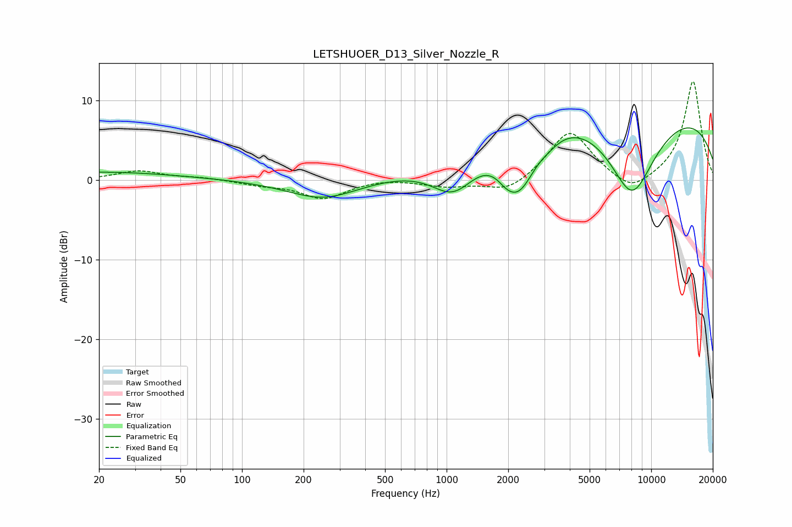

# LETSHUOER_D13_Silver_Nozzle_R
See [usage instructions](https://github.com/jaakkopasanen/AutoEq#usage) for more options and info.

### Parametric EQs
Apply preamp of -6.7 dB when using parametric equalizer.

|   # | Type    |   Fc (Hz) |    Q |   Gain (dB) |
|-----|---------|-----------|------|-------------|
|   1 | Peaking |        20 | 0.36 |         1   |
|   2 | Peaking |       250 | 0.82 |        -2.5 |
|   3 | Peaking |      1083 | 1.26 |        -4.9 |
|   4 | Peaking |      1971 | 2.8  |        -1.6 |
|   5 | Peaking |      2197 | 4.27 |        -0.1 |
|   6 | Peaking |      2303 | 1.68 |        -6.6 |
|   7 | Peaking |      3170 | 2.53 |        -0.8 |
|   8 | Peaking |      6671 | 0.45 |        -0.2 |
|   9 | Peaking |      7382 | 0.21 |        16   |
|  10 | Peaking |      8036 | 0.76 |       -16.7 |

### Fixed Band EQs
When using fixed band (also called graphic) equalizer, apply preamp of **-12.5 dB** (if available) and set gains manually with these parameters.

|   # | Type    |   Fc (Hz) |    Q |   Gain (dB) |
|-----|---------|-----------|------|-------------|
|   1 | Peaking |        31 | 1.41 |         1.1 |
|   2 | Peaking |        62 | 1.41 |         0.3 |
|   3 | Peaking |       125 | 1.41 |        -0.5 |
|   4 | Peaking |       250 | 1.41 |        -2.3 |
|   5 | Peaking |       500 | 1.41 |         0.3 |
|   6 | Peaking |      1000 | 1.41 |        -0.8 |
|   7 | Peaking |      2000 | 1.41 |        -1.7 |
|   8 | Peaking |      4000 | 1.41 |         6.3 |
|   9 | Peaking |      8000 | 1.41 |        -2   |
|  10 | Peaking |     16000 | 1.41 |        12.5 |

### Graphs

