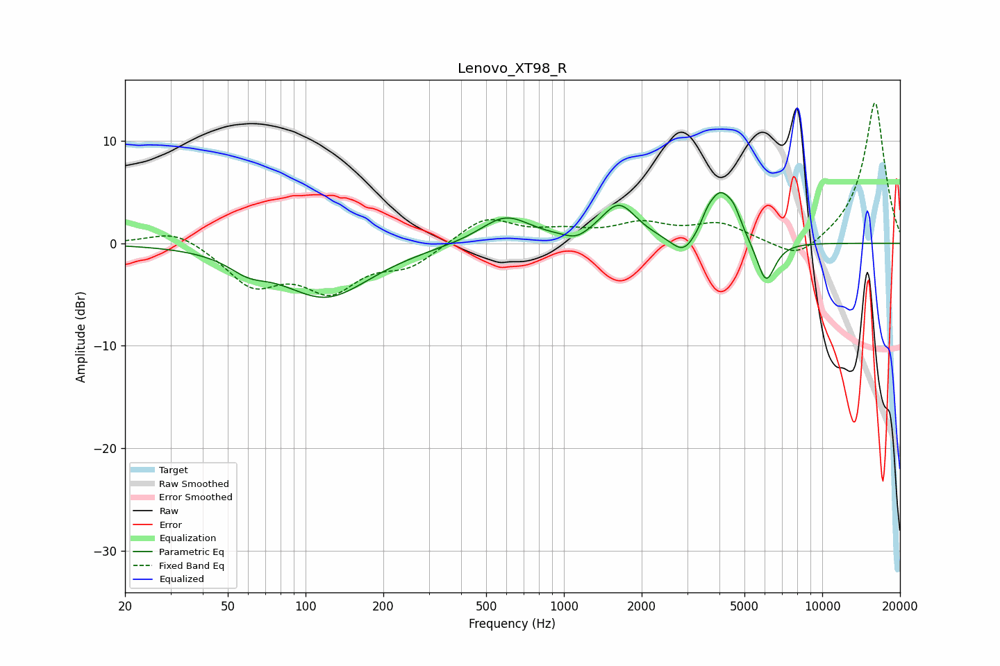

# Lenovo_XT98_R
See [usage instructions](https://github.com/jaakkopasanen/AutoEq#usage) for more options and info.

### Parametric EQs
Apply preamp of -5.0 dB when using parametric equalizer.

|   # | Type    |   Fc (Hz) |    Q |   Gain (dB) |
|-----|---------|-----------|------|-------------|
|   1 | Peaking |        60 | 1.9  |        -1.3 |
|   2 | Peaking |       120 | 0.82 |        -5.2 |
|   3 | Peaking |       593 | 1.45 |         2.7 |
|   4 | Peaking |      1120 | 3.05 |        -0.7 |
|   5 | Peaking |      1631 | 2.07 |         3.7 |
|   6 | Peaking |      2908 | 2.95 |        -1.9 |
|   7 | Peaking |      3583 | 6    |         0.8 |
|   8 | Peaking |      4007 | 2.94 |         4.5 |
|   9 | Peaking |      4557 | 4.6  |         1.7 |
|  10 | Peaking |      6056 | 3.84 |        -4.2 |

### Fixed Band EQs
When using fixed band (also called graphic) equalizer, apply preamp of **-13.8 dB** (if available) and set gains manually with these parameters.

|   # | Type    |   Fc (Hz) |    Q |   Gain (dB) |
|-----|---------|-----------|------|-------------|
|   1 | Peaking |        31 | 1.41 |         1.5 |
|   2 | Peaking |        62 | 1.41 |        -3.9 |
|   3 | Peaking |       125 | 1.41 |        -4.2 |
|   4 | Peaking |       250 | 1.41 |        -2   |
|   5 | Peaking |       500 | 1.41 |         2.6 |
|   6 | Peaking |      1000 | 1.41 |         0.9 |
|   7 | Peaking |      2000 | 1.41 |         1.7 |
|   8 | Peaking |      4000 | 1.41 |         1.8 |
|   9 | Peaking |      8000 | 1.41 |        -1.9 |
|  10 | Peaking |     16000 | 1.41 |        13.9 |

### Graphs

