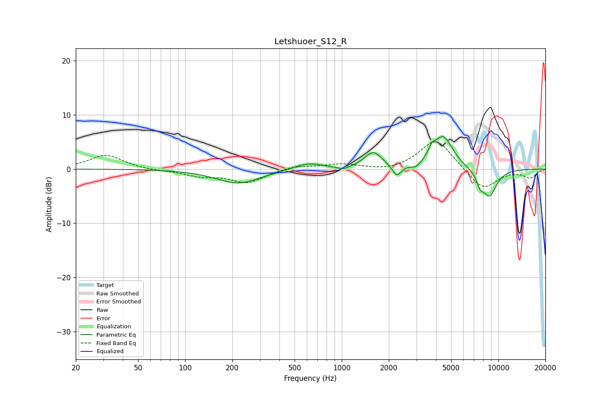

# Letshuoer_S12_R
See [usage instructions](https://github.com/jaakkopasanen/AutoEq#usage) for more options and info.

### Parametric EQs
Apply preamp of -6.1 dB when using parametric equalizer.

|   # | Type    |   Fc (Hz) |    Q |   Gain (dB) |
|-----|---------|-----------|------|-------------|
|   1 | Peaking |       219 | 1    |        -2.7 |
|   2 | Peaking |       609 | 1.51 |         1.2 |
|   3 | Peaking |      1027 | 3.36 |        -0.6 |
|   4 | Peaking |      1589 | 2.53 |         3   |
|   5 | Peaking |      2250 | 5.08 |        -2.1 |
|   6 | Peaking |      2990 | 4.56 |        -0.9 |
|   7 | Peaking |      3764 | 6    |         1.5 |
|   8 | Peaking |      4450 | 2.24 |         6   |
|   9 | Peaking |      7650 | 6    |        -1.8 |
|  10 | Peaking |      8774 | 2.68 |        -5.1 |

### Fixed Band EQs
When using fixed band (also called graphic) equalizer, apply preamp of **-5.1 dB** (if available) and set gains manually with these parameters.

|   # | Type    |   Fc (Hz) |    Q |   Gain (dB) |
|-----|---------|-----------|------|-------------|
|   1 | Peaking |        31 | 1.41 |         2.6 |
|   2 | Peaking |        62 | 1.41 |        -0.3 |
|   3 | Peaking |       125 | 1.41 |        -1.2 |
|   4 | Peaking |       250 | 1.41 |        -2.5 |
|   5 | Peaking |       500 | 1.41 |         0.6 |
|   6 | Peaking |      1000 | 1.41 |         0.9 |
|   7 | Peaking |      2000 | 1.41 |        -0.5 |
|   8 | Peaking |      4000 | 1.41 |         5.7 |
|   9 | Peaking |      8000 | 1.41 |        -3.9 |
|  10 | Peaking |     16000 | 1.41 |        -1.5 |

### Graphs

