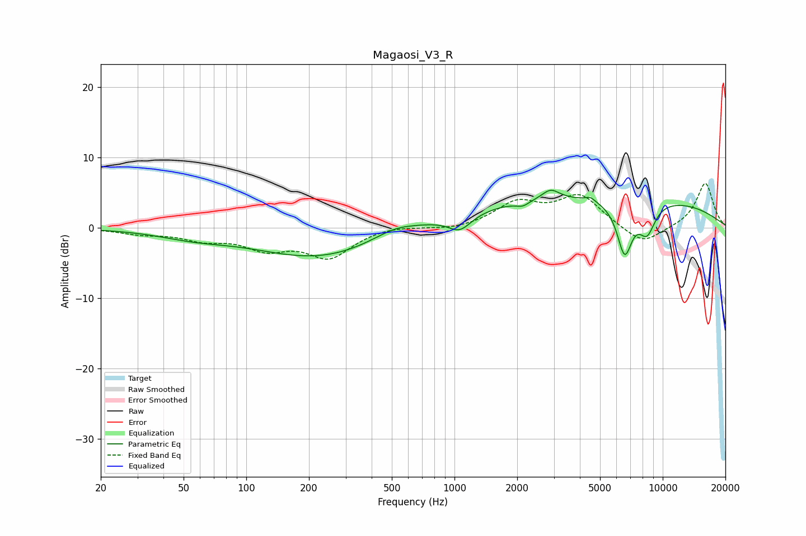

# Magaosi_V3_R
See [usage instructions](https://github.com/jaakkopasanen/AutoEq#usage) for more options and info.

### Parametric EQs
Apply preamp of -5.4 dB when using parametric equalizer.

|   # | Type    |   Fc (Hz) |    Q |   Gain (dB) |
|-----|---------|-----------|------|-------------|
|   1 | Peaking |        56 | 0.82 |        -1   |
|   2 | Peaking |       223 | 0.47 |        -4.2 |
|   3 | Peaking |       516 | 1.34 |         1.3 |
|   4 | Peaking |      1061 | 2.53 |        -2.2 |
|   5 | Peaking |      2127 | 4.48 |        -0.7 |
|   6 | Peaking |      2895 | 3.43 |         1.4 |
|   7 | Peaking |      4493 | 6    |         0.6 |
|   8 | Peaking |      5183 | 0.18 |         4.6 |
|   9 | Peaking |      6566 | 3.61 |        -7.5 |
|  10 | Peaking |      8407 | 3.23 |        -4.2 |

### Fixed Band EQs
When using fixed band (also called graphic) equalizer, apply preamp of **-6.4 dB** (if available) and set gains manually with these parameters.

|   # | Type    |   Fc (Hz) |    Q |   Gain (dB) |
|-----|---------|-----------|------|-------------|
|   1 | Peaking |        31 | 1.41 |        -0.7 |
|   2 | Peaking |        62 | 1.41 |        -1.4 |
|   3 | Peaking |       125 | 1.41 |        -2.6 |
|   4 | Peaking |       250 | 1.41 |        -4   |
|   5 | Peaking |       500 | 1.41 |         0.4 |
|   6 | Peaking |      1000 | 1.41 |        -0.4 |
|   7 | Peaking |      2000 | 1.41 |         3.4 |
|   8 | Peaking |      4000 | 1.41 |         4.4 |
|   9 | Peaking |      8000 | 1.41 |        -2.6 |
|  10 | Peaking |     16000 | 1.41 |         6.4 |

### Graphs

