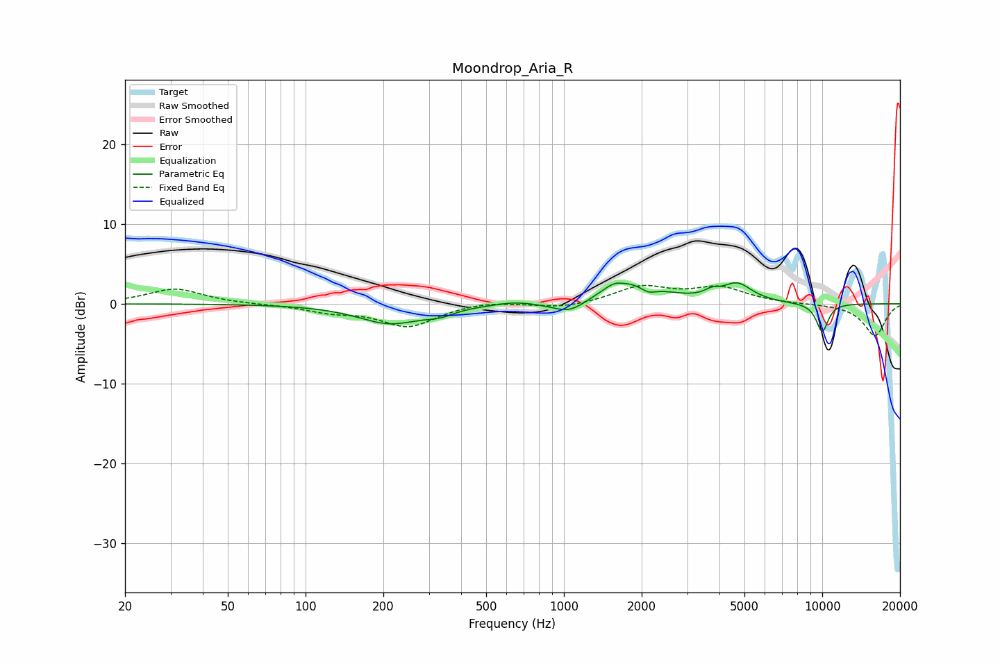

# Moondrop_Aria_R
See [usage instructions](https://github.com/jaakkopasanen/AutoEq#usage) for more options and info.

### Parametric EQs
Apply preamp of -2.7 dB when using parametric equalizer.

|   # | Type    |   Fc (Hz) |    Q |   Gain (dB) |
|-----|---------|-----------|------|-------------|
|   1 | Peaking |       212 | 1.13 |        -2.4 |
|   2 | Peaking |       331 | 2.64 |        -0.7 |
|   3 | Peaking |       639 | 2.07 |         0.4 |
|   4 | Peaking |      1055 | 2.05 |        -1.7 |
|   5 | Peaking |      1557 | 4.36 |         0.5 |
|   6 | Peaking |      1772 | 1.15 |         2.7 |
|   7 | Peaking |      2117 | 4.84 |        -0.8 |
|   8 | Peaking |      3732 | 5.2  |         0.7 |
|   9 | Peaking |      4680 | 2.42 |         2.3 |
|  10 | Peaking |     10000 | 5.12 |        -3.6 |

### Fixed Band EQs
When using fixed band (also called graphic) equalizer, apply preamp of **-2.4 dB** (if available) and set gains manually with these parameters.

|   # | Type    |   Fc (Hz) |    Q |   Gain (dB) |
|-----|---------|-----------|------|-------------|
|   1 | Peaking |        31 | 1.41 |         1.9 |
|   2 | Peaking |        62 | 1.41 |        -0   |
|   3 | Peaking |       125 | 1.41 |        -0.9 |
|   4 | Peaking |       250 | 1.41 |        -2.8 |
|   5 | Peaking |       500 | 1.41 |         0.4 |
|   6 | Peaking |      1000 | 1.41 |        -0.6 |
|   7 | Peaking |      2000 | 1.41 |         2.1 |
|   8 | Peaking |      4000 | 1.41 |         1.9 |
|   9 | Peaking |      8000 | 1.41 |        -0   |
|  10 | Peaking |     16000 | 1.41 |        -4   |

### Graphs

