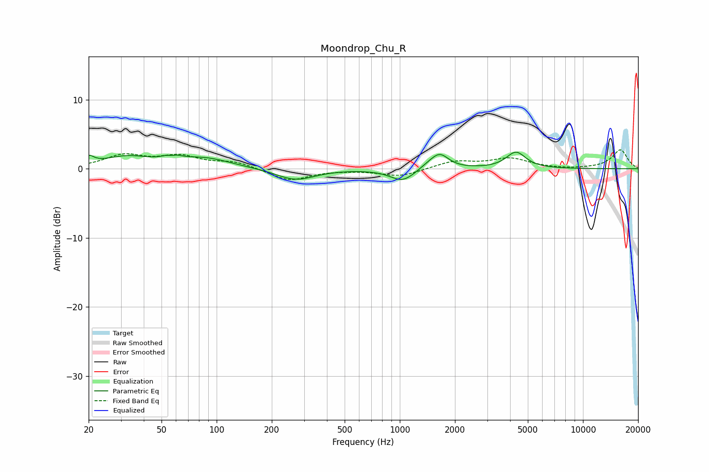

# Moondrop_Chu_R
See [usage instructions](https://github.com/jaakkopasanen/AutoEq#usage) for more options and info.

### Parametric EQs
Apply preamp of -2.5 dB when using parametric equalizer.

|   # | Type    |   Fc (Hz) |    Q |   Gain (dB) |
|-----|---------|-----------|------|-------------|
|   1 | Peaking |        20 | 5.21 |         1.1 |
|   2 | Peaking |        32 | 1.08 |         1.6 |
|   3 | Peaking |        57 | 5.63 |        -1.4 |
|   4 | Peaking |        57 | 4.26 |         1.9 |
|   5 | Peaking |        86 | 0.99 |         1.4 |
|   6 | Peaking |       270 | 1.35 |        -1.7 |
|   7 | Peaking |      1037 | 2.1  |        -1.8 |
|   8 | Peaking |      1436 | 2.7  |         0.5 |
|   9 | Peaking |      1655 | 2.93 |         2   |
|  10 | Peaking |      4310 | 2.68 |         2.4 |

### Fixed Band EQs
When using fixed band (also called graphic) equalizer, apply preamp of **-2.8 dB** (if available) and set gains manually with these parameters.

|   # | Type    |   Fc (Hz) |    Q |   Gain (dB) |
|-----|---------|-----------|------|-------------|
|   1 | Peaking |        31 | 1.41 |         1.8 |
|   2 | Peaking |        62 | 1.41 |         1.6 |
|   3 | Peaking |       125 | 1.41 |         0.9 |
|   4 | Peaking |       250 | 1.41 |        -1.7 |
|   5 | Peaking |       500 | 1.41 |        -0.1 |
|   6 | Peaking |      1000 | 1.41 |        -1.1 |
|   7 | Peaking |      2000 | 1.41 |         1.1 |
|   8 | Peaking |      4000 | 1.41 |         1.4 |
|   9 | Peaking |      8000 | 1.41 |        -0.1 |
|  10 | Peaking |     16000 | 1.41 |         2.7 |

### Graphs

