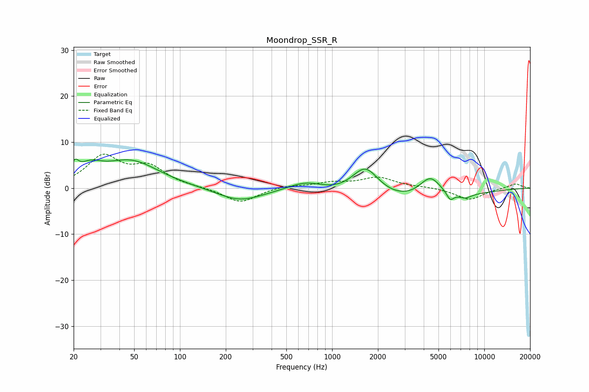

# Moondrop_SSR_R
See [usage instructions](https://github.com/jaakkopasanen/AutoEq#usage) for more options and info.

### Parametric EQs
Apply preamp of -6.4 dB when using parametric equalizer.

|   # | Type    |   Fc (Hz) |    Q |   Gain (dB) |
|-----|---------|-----------|------|-------------|
|   1 | Peaking |        20 | 6    |         2.6 |
|   2 | Peaking |        25 | 1.8  |         3   |
|   3 | Peaking |        48 | 0.76 |         5.8 |
|   4 | Peaking |       246 | 0.94 |        -2.8 |
|   5 | Peaking |       673 | 1.17 |         2.3 |
|   6 | Peaking |      1653 | 1.49 |         7   |
|   7 | Peaking |      2567 | 0.32 |        -3.7 |
|   8 | Peaking |      4417 | 1.91 |         4.8 |
|   9 | Peaking |      5971 | 5.73 |        -1.8 |
|  10 | Peaking |      7514 | 3.27 |        -0.9 |

### Fixed Band EQs
When using fixed band (also called graphic) equalizer, apply preamp of **-7.5 dB** (if available) and set gains manually with these parameters.

|   # | Type    |   Fc (Hz) |    Q |   Gain (dB) |
|-----|---------|-----------|------|-------------|
|   1 | Peaking |        31 | 1.41 |         6.6 |
|   2 | Peaking |        62 | 1.41 |         4.2 |
|   3 | Peaking |       125 | 1.41 |         0.1 |
|   4 | Peaking |       250 | 1.41 |        -3.2 |
|   5 | Peaking |       500 | 1.41 |         0.6 |
|   6 | Peaking |      1000 | 1.41 |         1.1 |
|   7 | Peaking |      2000 | 1.41 |         2.2 |
|   8 | Peaking |      4000 | 1.41 |         0.2 |
|   9 | Peaking |      8000 | 1.41 |        -2.5 |
|  10 | Peaking |     16000 | 1.41 |         1   |

### Graphs

