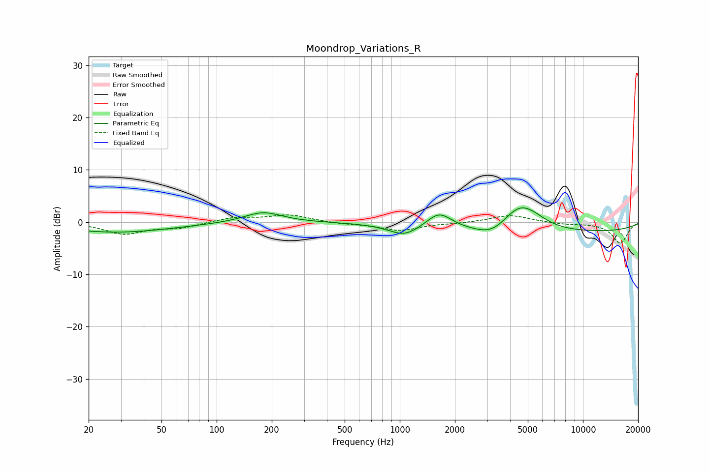

# Moondrop_Variations_R
See [usage instructions](https://github.com/jaakkopasanen/AutoEq#usage) for more options and info.

### Parametric EQs
Apply preamp of -2.8 dB when using parametric equalizer.

|   # | Type    |   Fc (Hz) |    Q |   Gain (dB) |
|-----|---------|-----------|------|-------------|
|   1 | Peaking |        20 | 1.36 |         0   |
|   2 | Peaking |        28 | 0.46 |        -2   |
|   3 | Peaking |       180 | 1.39 |         2   |
|   4 | Peaking |      1056 | 1.68 |        -2.2 |
|   5 | Peaking |      1638 | 2.08 |         3.1 |
|   6 | Peaking |      3185 | 1.58 |        -2   |
|   7 | Peaking |      4481 | 1.49 |         4.7 |
|   8 | Peaking |      5432 | 1.83 |         0.9 |
|   9 | Peaking |      7317 | 0.18 |        -2   |
|  10 | Peaking |      7651 | 1.49 |         0   |

### Fixed Band EQs
When using fixed band (also called graphic) equalizer, apply preamp of **-1.5 dB** (if available) and set gains manually with these parameters.

|   # | Type    |   Fc (Hz) |    Q |   Gain (dB) |
|-----|---------|-----------|------|-------------|
|   1 | Peaking |        31 | 1.41 |        -2.2 |
|   2 | Peaking |        62 | 1.41 |        -1   |
|   3 | Peaking |       125 | 1.41 |         0.9 |
|   4 | Peaking |       250 | 1.41 |         1.4 |
|   5 | Peaking |       500 | 1.41 |        -0.3 |
|   6 | Peaking |      1000 | 1.41 |        -1.6 |
|   7 | Peaking |      2000 | 1.41 |        -0.2 |
|   8 | Peaking |      4000 | 1.41 |         1.4 |
|   9 | Peaking |      8000 | 1.41 |        -0.4 |
|  10 | Peaking |     16000 | 1.41 |        -4.1 |

### Graphs

