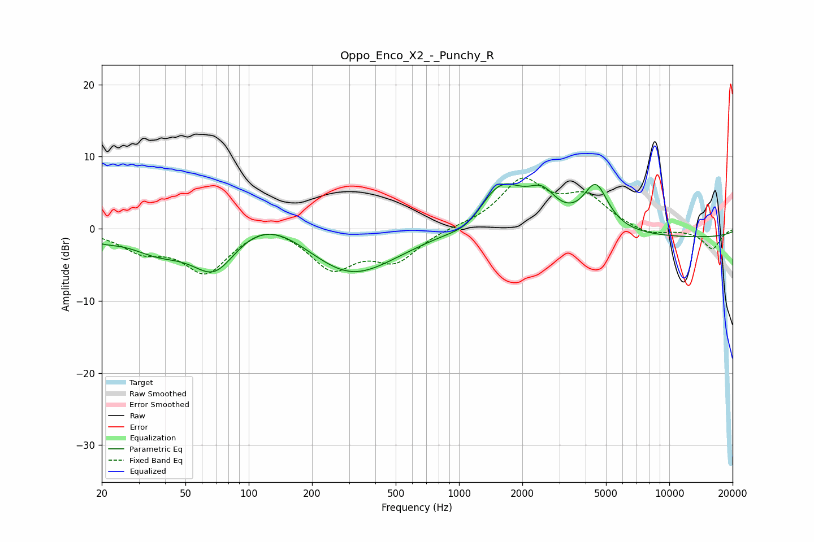

# Oppo_Enco_X2_-_Punchy_R
See [usage instructions](https://github.com/jaakkopasanen/AutoEq#usage) for more options and info.

### Parametric EQs
Apply preamp of -6.3 dB when using parametric equalizer.

|   # | Type    |   Fc (Hz) |    Q |   Gain (dB) |
|-----|---------|-----------|------|-------------|
|   1 | Peaking |        20 | 1.88 |        -0.9 |
|   2 | Peaking |        37 | 1.07 |        -2.6 |
|   3 | Peaking |        69 | 1.25 |        -6.6 |
|   4 | Peaking |       118 | 0.7  |         4.2 |
|   5 | Peaking |       302 | 0.63 |        -7   |
|   6 | Peaking |      1120 | 1.53 |        -2   |
|   7 | Peaking |      1561 | 1.17 |         7.2 |
|   8 | Peaking |      2491 | 2.13 |         3.4 |
|   9 | Peaking |      4472 | 2.35 |         6.2 |
|  10 | Peaking |      9838 | 0.18 |        -1.3 |

### Fixed Band EQs
When using fixed band (also called graphic) equalizer, apply preamp of **-7.1 dB** (if available) and set gains manually with these parameters.

|   # | Type    |   Fc (Hz) |    Q |   Gain (dB) |
|-----|---------|-----------|------|-------------|
|   1 | Peaking |        31 | 1.41 |        -2.6 |
|   2 | Peaking |        62 | 1.41 |        -5.8 |
|   3 | Peaking |       125 | 1.41 |         1.5 |
|   4 | Peaking |       250 | 1.41 |        -5.2 |
|   5 | Peaking |       500 | 1.41 |        -4.1 |
|   6 | Peaking |      1000 | 1.41 |         0.2 |
|   7 | Peaking |      2000 | 1.41 |         6.5 |
|   8 | Peaking |      4000 | 1.41 |         4.1 |
|   9 | Peaking |      8000 | 1.41 |        -1   |
|  10 | Peaking |     16000 | 1.41 |        -2.8 |

### Graphs

