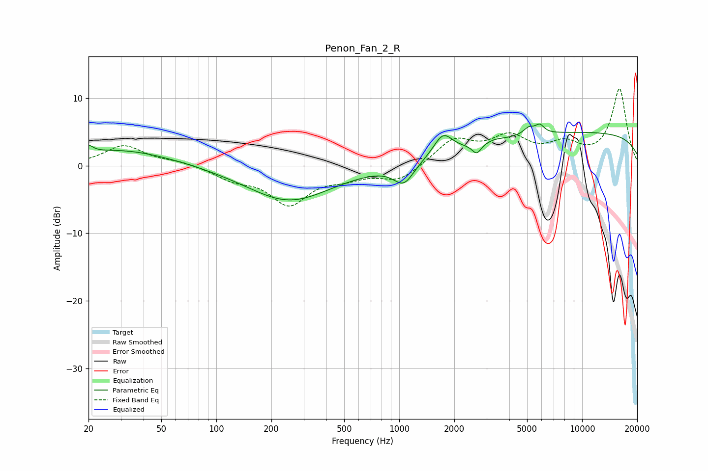

# Penon_Fan_2_R
See [usage instructions](https://github.com/jaakkopasanen/AutoEq#usage) for more options and info.

### Parametric EQs
Apply preamp of -6.3 dB when using parametric equalizer.

|   # | Type    |   Fc (Hz) |    Q |   Gain (dB) |
|-----|---------|-----------|------|-------------|
|   1 | Peaking |        20 | 5.83 |         1   |
|   2 | Peaking |        30 | 0.49 |         2.4 |
|   3 | Peaking |       250 | 0.61 |        -5.2 |
|   4 | Peaking |      1059 | 2.54 |        -3.1 |
|   5 | Peaking |      1735 | 2.74 |         3.2 |
|   6 | Peaking |      2651 | 5.76 |        -1.5 |
|   7 | Peaking |      3314 | 2.92 |         0.3 |
|   8 | Peaking |      5113 | 4.62 |         1.1 |
|   9 | Peaking |      5868 | 5.77 |         1.2 |
|  10 | Peaking |     10000 | 0.18 |         4.9 |

### Fixed Band EQs
When using fixed band (also called graphic) equalizer, apply preamp of **-11.5 dB** (if available) and set gains manually with these parameters.

|   # | Type    |   Fc (Hz) |    Q |   Gain (dB) |
|-----|---------|-----------|------|-------------|
|   1 | Peaking |        31 | 1.41 |         3   |
|   2 | Peaking |        62 | 1.41 |         0.6 |
|   3 | Peaking |       125 | 1.41 |        -1.7 |
|   4 | Peaking |       250 | 1.41 |        -5.4 |
|   5 | Peaking |       500 | 1.41 |        -1.3 |
|   6 | Peaking |      1000 | 1.41 |        -2.2 |
|   7 | Peaking |      2000 | 1.41 |         3.7 |
|   8 | Peaking |      4000 | 1.41 |         3.8 |
|   9 | Peaking |      8000 | 1.41 |         2.7 |
|  10 | Peaking |     16000 | 1.41 |        11.3 |

### Graphs

