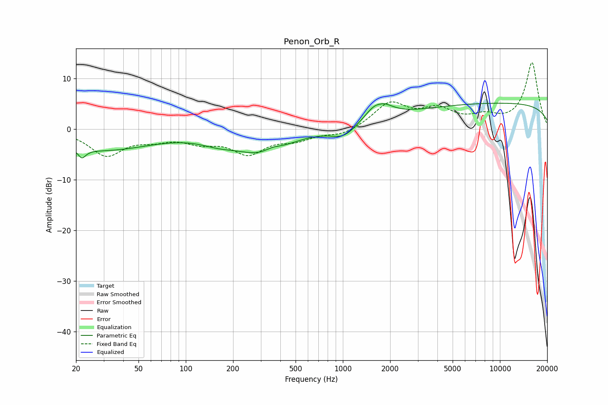

# Penon_Orb_R
See [usage instructions](https://github.com/jaakkopasanen/AutoEq#usage) for more options and info.

### Parametric EQs
Apply preamp of -5.2 dB when using parametric equalizer.

|   # | Type    |   Fc (Hz) |    Q |   Gain (dB) |
|-----|---------|-----------|------|-------------|
|   1 | Peaking |        22 | 5.84 |        -5.1 |
|   2 | Peaking |        22 | 5.99 |         3.2 |
|   3 | Peaking |        29 | 0.44 |        -4.1 |
|   4 | Peaking |       161 | 1.16 |        -1.4 |
|   5 | Peaking |       311 | 0.84 |        -4.5 |
|   6 | Peaking |       355 | 2.52 |         1   |
|   7 | Peaking |      1016 | 1.75 |        -2.3 |
|   8 | Peaking |      1688 | 1.85 |         4.1 |
|   9 | Peaking |      1712 | 4.62 |        -0.5 |
|  10 | Peaking |     10000 | 0.18 |         5.1 |

### Fixed Band EQs
When using fixed band (also called graphic) equalizer, apply preamp of **-13.2 dB** (if available) and set gains manually with these parameters.

|   # | Type    |   Fc (Hz) |    Q |   Gain (dB) |
|-----|---------|-----------|------|-------------|
|   1 | Peaking |        31 | 1.41 |        -5   |
|   2 | Peaking |        62 | 1.41 |        -1.6 |
|   3 | Peaking |       125 | 1.41 |        -2.1 |
|   4 | Peaking |       250 | 1.41 |        -4.5 |
|   5 | Peaking |       500 | 1.41 |        -1.8 |
|   6 | Peaking |      1000 | 1.41 |        -1.3 |
|   7 | Peaking |      2000 | 1.41 |         5   |
|   8 | Peaking |      4000 | 1.41 |         3.4 |
|   9 | Peaking |      8000 | 1.41 |         1.9 |
|  10 | Peaking |     16000 | 1.41 |        13.1 |

### Graphs

