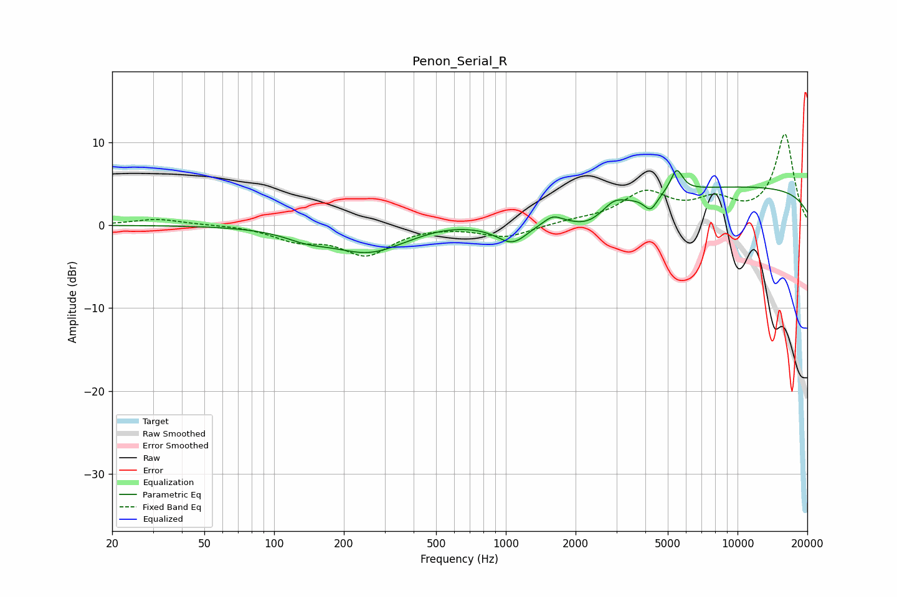

# Penon_Serial_R
See [usage instructions](https://github.com/jaakkopasanen/AutoEq#usage) for more options and info.

### Parametric EQs
Apply preamp of -6.7 dB when using parametric equalizer.

|   # | Type    |   Fc (Hz) |    Q |   Gain (dB) |
|-----|---------|-----------|------|-------------|
|   1 | Peaking |       138 | 1.47 |        -1   |
|   2 | Peaking |       256 | 0.9  |        -3.1 |
|   3 | Peaking |       550 | 1.29 |         0.4 |
|   4 | Peaking |      1071 | 2.05 |        -2.6 |
|   5 | Peaking |      1597 | 3.86 |         0.9 |
|   6 | Peaking |      2264 | 1.62 |        -2   |
|   7 | Peaking |      2924 | 3.11 |         1.1 |
|   8 | Peaking |      4218 | 4.8  |        -1.9 |
|   9 | Peaking |      5460 | 5.42 |         2.7 |
|  10 | Peaking |     10000 | 0.18 |         4.6 |

### Fixed Band EQs
When using fixed band (also called graphic) equalizer, apply preamp of **-11.1 dB** (if available) and set gains manually with these parameters.

|   # | Type    |   Fc (Hz) |    Q |   Gain (dB) |
|-----|---------|-----------|------|-------------|
|   1 | Peaking |        31 | 1.41 |         0.8 |
|   2 | Peaking |        62 | 1.41 |         0.1 |
|   3 | Peaking |       125 | 1.41 |        -1.6 |
|   4 | Peaking |       250 | 1.41 |        -3.4 |
|   5 | Peaking |       500 | 1.41 |         0   |
|   6 | Peaking |      1000 | 1.41 |        -1.4 |
|   7 | Peaking |      2000 | 1.41 |         0.4 |
|   8 | Peaking |      4000 | 1.41 |         3.7 |
|   9 | Peaking |      8000 | 1.41 |         2.5 |
|  10 | Peaking |     16000 | 1.41 |        10.9 |

### Graphs

