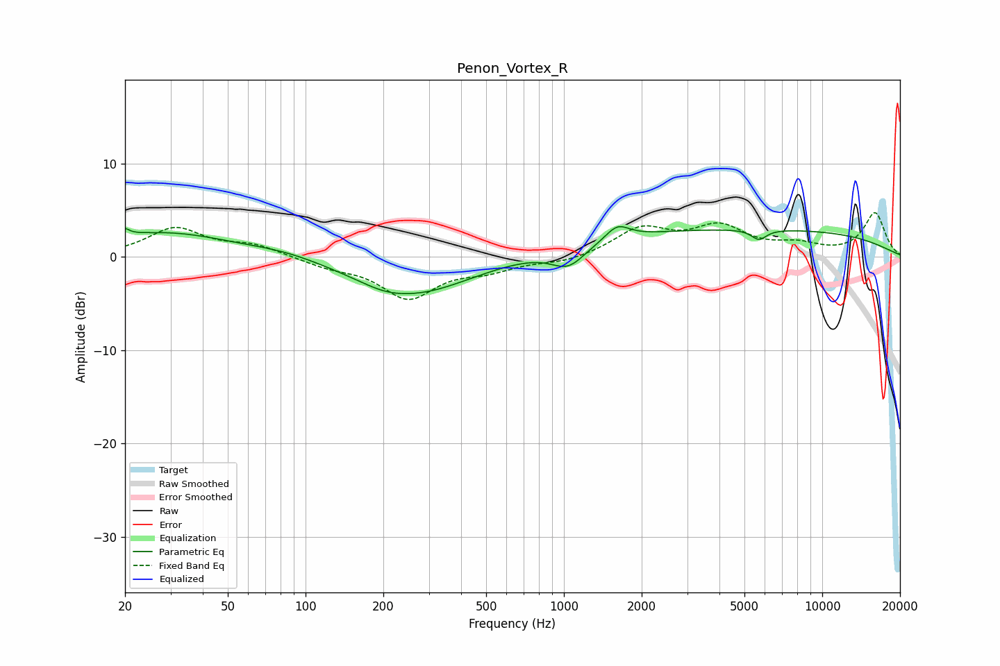

# Penon_Vortex_R
See [usage instructions](https://github.com/jaakkopasanen/AutoEq#usage) for more options and info.

### Parametric EQs
Apply preamp of -3.3 dB when using parametric equalizer.

|   # | Type    |   Fc (Hz) |    Q |   Gain (dB) |
|-----|---------|-----------|------|-------------|
|   1 | Peaking |        20 | 5.95 |         2.7 |
|   2 | Peaking |        20 | 5.96 |        -1.8 |
|   3 | Peaking |        28 | 0.55 |         2.6 |
|   4 | Peaking |        84 | 0.96 |         0.6 |
|   5 | Peaking |       201 | 1.71 |        -0.4 |
|   6 | Peaking |       262 | 0.62 |        -4   |
|   7 | Peaking |      1040 | 2.13 |        -2.2 |
|   8 | Peaking |      1610 | 3.1  |         1.6 |
|   9 | Peaking |      4874 | 0.18 |         3   |
|  10 | Peaking |      5690 | 4.74 |        -1.1 |

### Fixed Band EQs
When using fixed band (also called graphic) equalizer, apply preamp of **-4.8 dB** (if available) and set gains manually with these parameters.

|   # | Type    |   Fc (Hz) |    Q |   Gain (dB) |
|-----|---------|-----------|------|-------------|
|   1 | Peaking |        31 | 1.41 |         3   |
|   2 | Peaking |        62 | 1.41 |         1.2 |
|   3 | Peaking |       125 | 1.41 |        -0.9 |
|   4 | Peaking |       250 | 1.41 |        -4.2 |
|   5 | Peaking |       500 | 1.41 |        -1.2 |
|   6 | Peaking |      1000 | 1.41 |        -0.6 |
|   7 | Peaking |      2000 | 1.41 |         2.9 |
|   8 | Peaking |      4000 | 1.41 |         3   |
|   9 | Peaking |      8000 | 1.41 |         1.1 |
|  10 | Peaking |     16000 | 1.41 |         4.7 |

### Graphs

