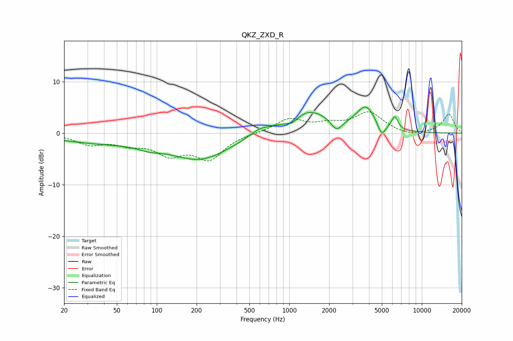

# QKZ_ZXD_R
See [usage instructions](https://github.com/jaakkopasanen/AutoEq#usage) for more options and info.

### Parametric EQs
Apply preamp of -5.1 dB when using parametric equalizer.

|   # | Type    |   Fc (Hz) |    Q |   Gain (dB) |
|-----|---------|-----------|------|-------------|
|   1 | Peaking |        37 | 0.43 |        -1.7 |
|   2 | Peaking |        88 | 1.61 |        -0.8 |
|   3 | Peaking |       213 | 0.62 |        -4.9 |
|   4 | Peaking |       599 | 1.84 |         1.2 |
|   5 | Peaking |      1050 | 3.04 |        -1.1 |
|   6 | Peaking |      1398 | 0.88 |         4.4 |
|   7 | Peaking |      2271 | 3.47 |        -2.2 |
|   8 | Peaking |      3780 | 1.99 |         4.6 |
|   9 | Peaking |      4969 | 5.01 |        -2.4 |
|  10 | Peaking |      6248 | 5.7  |         2.5 |

### Fixed Band EQs
When using fixed band (also called graphic) equalizer, apply preamp of **-4.2 dB** (if available) and set gains manually with these parameters.

|   # | Type    |   Fc (Hz) |    Q |   Gain (dB) |
|-----|---------|-----------|------|-------------|
|   1 | Peaking |        31 | 1.41 |        -2   |
|   2 | Peaking |        62 | 1.41 |        -1.7 |
|   3 | Peaking |       125 | 1.41 |        -3.6 |
|   4 | Peaking |       250 | 1.41 |        -4.7 |
|   5 | Peaking |       500 | 1.41 |        -0   |
|   6 | Peaking |      1000 | 1.41 |         2.6 |
|   7 | Peaking |      2000 | 1.41 |         1.4 |
|   8 | Peaking |      4000 | 1.41 |         3.9 |
|   9 | Peaking |      8000 | 1.41 |        -0.6 |
|  10 | Peaking |     16000 | 1.41 |         3.7 |

### Graphs

