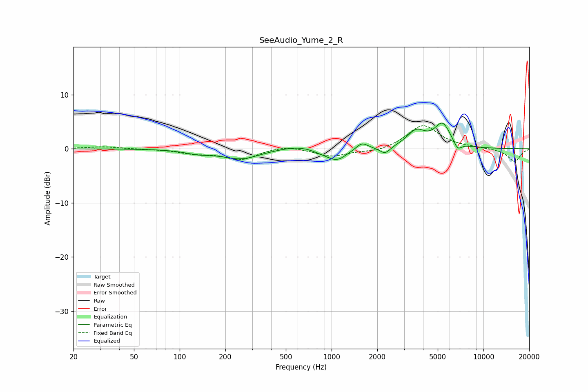

# SeeAudio_Yume_2_R
See [usage instructions](https://github.com/jaakkopasanen/AutoEq#usage) for more options and info.

### Parametric EQs
Apply preamp of -4.8 dB when using parametric equalizer.

|   # | Type    |   Fc (Hz) |    Q |   Gain (dB) |
|-----|---------|-----------|------|-------------|
|   1 | Peaking |       133 | 1.61 |        -0.7 |
|   2 | Peaking |       255 | 1.16 |        -1.8 |
|   3 | Peaking |       611 | 1.19 |         0.8 |
|   4 | Peaking |       874 | 2.04 |        -0.6 |
|   5 | Peaking |      1090 | 2.22 |        -2   |
|   6 | Peaking |      1585 | 3.67 |         1.3 |
|   7 | Peaking |      2251 | 4.16 |        -1.3 |
|   8 | Peaking |      3602 | 2.25 |         3   |
|   9 | Peaking |      5377 | 2.61 |         4.3 |
|  10 | Peaking |      6758 | 5.21 |        -1.5 |

### Fixed Band EQs
When using fixed band (also called graphic) equalizer, apply preamp of **-4.4 dB** (if available) and set gains manually with these parameters.

|   # | Type    |   Fc (Hz) |    Q |   Gain (dB) |
|-----|---------|-----------|------|-------------|
|   1 | Peaking |        31 | 1.41 |         0.4 |
|   2 | Peaking |        62 | 1.41 |        -0   |
|   3 | Peaking |       125 | 1.41 |        -0.7 |
|   4 | Peaking |       250 | 1.41 |        -2   |
|   5 | Peaking |       500 | 1.41 |         0.7 |
|   6 | Peaking |      1000 | 1.41 |        -1.4 |
|   7 | Peaking |      2000 | 1.41 |        -0.6 |
|   8 | Peaking |      4000 | 1.41 |         4.4 |
|   9 | Peaking |      8000 | 1.41 |         0.2 |
|  10 | Peaking |     16000 | 1.41 |        -2.4 |

### Graphs

