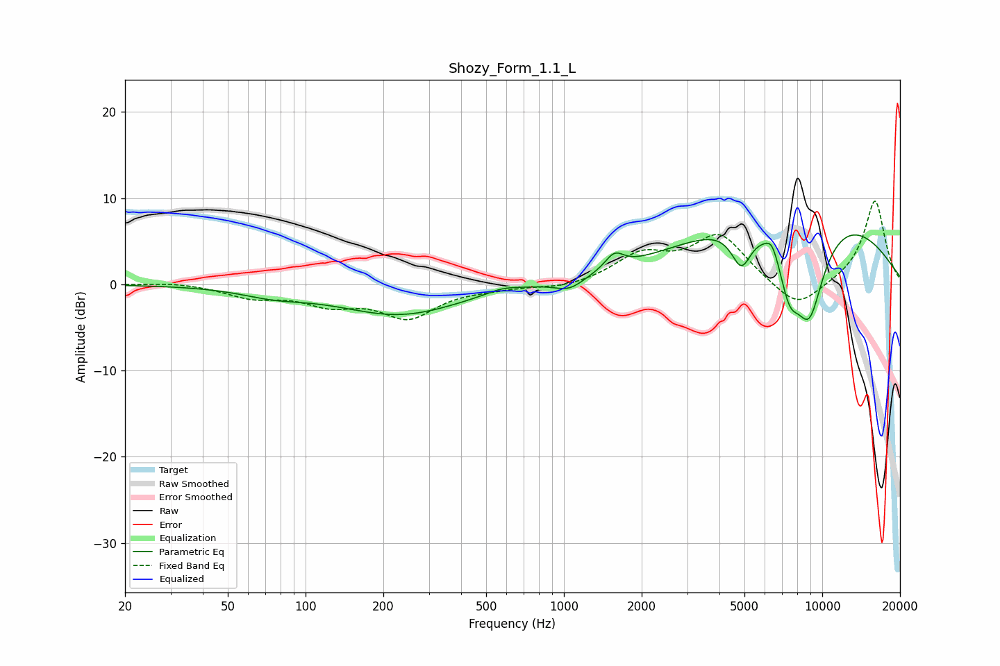

# Shozy_Form_1.1_L
See [usage instructions](https://github.com/jaakkopasanen/AutoEq#usage) for more options and info.

### Parametric EQs
Apply preamp of -5.8 dB when using parametric equalizer.

|   # | Type    |   Fc (Hz) |    Q |   Gain (dB) |
|-----|---------|-----------|------|-------------|
|   1 | Peaking |        75 | 1.1  |        -0.9 |
|   2 | Peaking |       232 | 0.6  |        -3.5 |
|   3 | Peaking |       577 | 2.27 |         0.5 |
|   4 | Peaking |      1050 | 2.44 |        -1.3 |
|   5 | Peaking |      1568 | 3.96 |         1.8 |
|   6 | Peaking |      4864 | 3.51 |        -4.5 |
|   7 | Peaking |      6395 | 5.54 |         1.5 |
|   8 | Peaking |      7459 | 3.07 |        -5.8 |
|   9 | Peaking |      8238 | 0.35 |        11.4 |
|  10 | Peaking |      8902 | 1.76 |       -13.1 |

### Fixed Band EQs
When using fixed band (also called graphic) equalizer, apply preamp of **-9.8 dB** (if available) and set gains manually with these parameters.

|   # | Type    |   Fc (Hz) |    Q |   Gain (dB) |
|-----|---------|-----------|------|-------------|
|   1 | Peaking |        31 | 1.41 |         0.3 |
|   2 | Peaking |        62 | 1.41 |        -1.4 |
|   3 | Peaking |       125 | 1.41 |        -2   |
|   4 | Peaking |       250 | 1.41 |        -3.6 |
|   5 | Peaking |       500 | 1.41 |        -0.3 |
|   6 | Peaking |      1000 | 1.41 |        -0.5 |
|   7 | Peaking |      2000 | 1.41 |         3.1 |
|   8 | Peaking |      4000 | 1.41 |         5.6 |
|   9 | Peaking |      8000 | 1.41 |        -3.2 |
|  10 | Peaking |     16000 | 1.41 |         9.8 |

### Graphs

