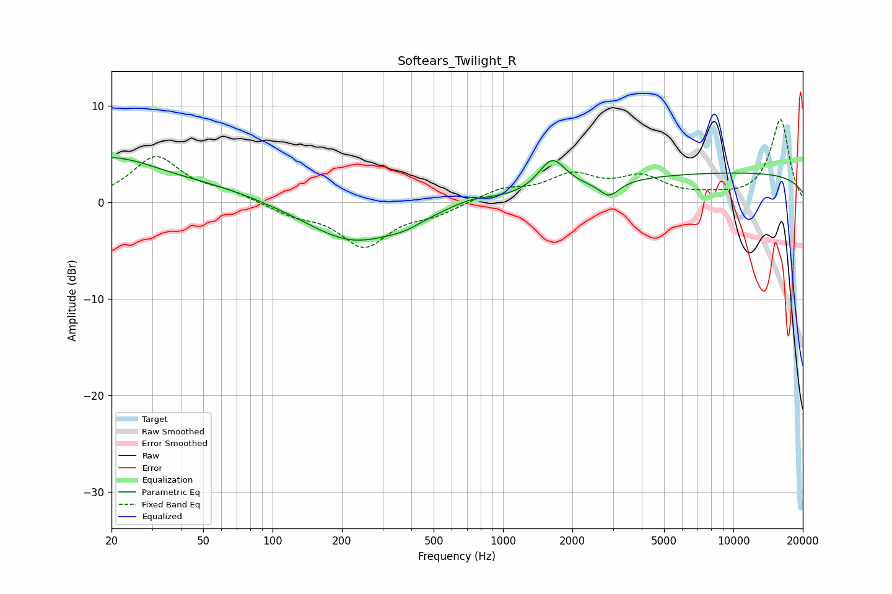

# Softears_Twilight_R
See [usage instructions](https://github.com/jaakkopasanen/AutoEq#usage) for more options and info.

### Parametric EQs
Apply preamp of -4.7 dB when using parametric equalizer.

|   # | Type    |   Fc (Hz) |    Q |   Gain (dB) |
|-----|---------|-----------|------|-------------|
|   1 | Peaking |        20 | 5.83 |         2.5 |
|   2 | Peaking |        20 | 0.68 |         4.2 |
|   3 | Peaking |        20 | 5.89 |        -2.4 |
|   4 | Peaking |        55 | 0.61 |         1.2 |
|   5 | Peaking |       223 | 0.7  |        -4.1 |
|   6 | Peaking |       376 | 1.68 |        -0.7 |
|   7 | Peaking |       727 | 1.58 |         0.6 |
|   8 | Peaking |      1635 | 2.4  |         3.4 |
|   9 | Peaking |      2889 | 3.29 |        -1.6 |
|  10 | Peaking |     10000 | 0.18 |         3   |

### Fixed Band EQs
When using fixed band (also called graphic) equalizer, apply preamp of **-8.7 dB** (if available) and set gains manually with these parameters.

|   # | Type    |   Fc (Hz) |    Q |   Gain (dB) |
|-----|---------|-----------|------|-------------|
|   1 | Peaking |        31 | 1.41 |         4.7 |
|   2 | Peaking |        62 | 1.41 |         0.9 |
|   3 | Peaking |       125 | 1.41 |        -1.1 |
|   4 | Peaking |       250 | 1.41 |        -4.4 |
|   5 | Peaking |       500 | 1.41 |        -1.1 |
|   6 | Peaking |      1000 | 1.41 |         1.3 |
|   7 | Peaking |      2000 | 1.41 |         2.6 |
|   8 | Peaking |      4000 | 1.41 |         2.3 |
|   9 | Peaking |      8000 | 1.41 |         0.4 |
|  10 | Peaking |     16000 | 1.41 |         8.6 |

### Graphs

