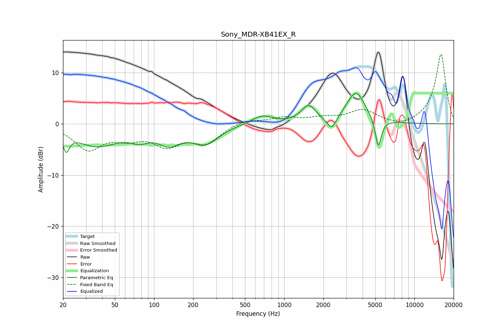

# Sony_MDR-XB41EX_R
See [usage instructions](https://github.com/jaakkopasanen/AutoEq#usage) for more options and info.

### Parametric EQs
Apply preamp of -6.0 dB when using parametric equalizer.

|   # | Type    |   Fc (Hz) |    Q |   Gain (dB) |
|-----|---------|-----------|------|-------------|
|   1 | Peaking |        21 | 5.85 |        -3.3 |
|   2 | Peaking |        36 | 0.84 |        -4.1 |
|   3 | Peaking |        77 | 2.04 |        -1.7 |
|   4 | Peaking |       131 | 1.67 |        -3.1 |
|   5 | Peaking |       248 | 1.4  |        -3.6 |
|   6 | Peaking |       676 | 1.77 |         1.7 |
|   7 | Peaking |      1535 | 2.6  |         3.3 |
|   8 | Peaking |      2317 | 3.9  |        -2.6 |
|   9 | Peaking |      3557 | 1.92 |         6.2 |
|  10 | Peaking |      5280 | 5.93 |        -5.8 |

### Fixed Band EQs
When using fixed band (also called graphic) equalizer, apply preamp of **-13.7 dB** (if available) and set gains manually with these parameters.

|   # | Type    |   Fc (Hz) |    Q |   Gain (dB) |
|-----|---------|-----------|------|-------------|
|   1 | Peaking |        31 | 1.41 |        -4.8 |
|   2 | Peaking |        62 | 1.41 |        -2.1 |
|   3 | Peaking |       125 | 1.41 |        -3.7 |
|   4 | Peaking |       250 | 1.41 |        -3.5 |
|   5 | Peaking |       500 | 1.41 |         0.9 |
|   6 | Peaking |      1000 | 1.41 |         1.1 |
|   7 | Peaking |      2000 | 1.41 |         1   |
|   8 | Peaking |      4000 | 1.41 |         2.6 |
|   9 | Peaking |      8000 | 1.41 |        -0.8 |
|  10 | Peaking |     16000 | 1.41 |        13.7 |

### Graphs

