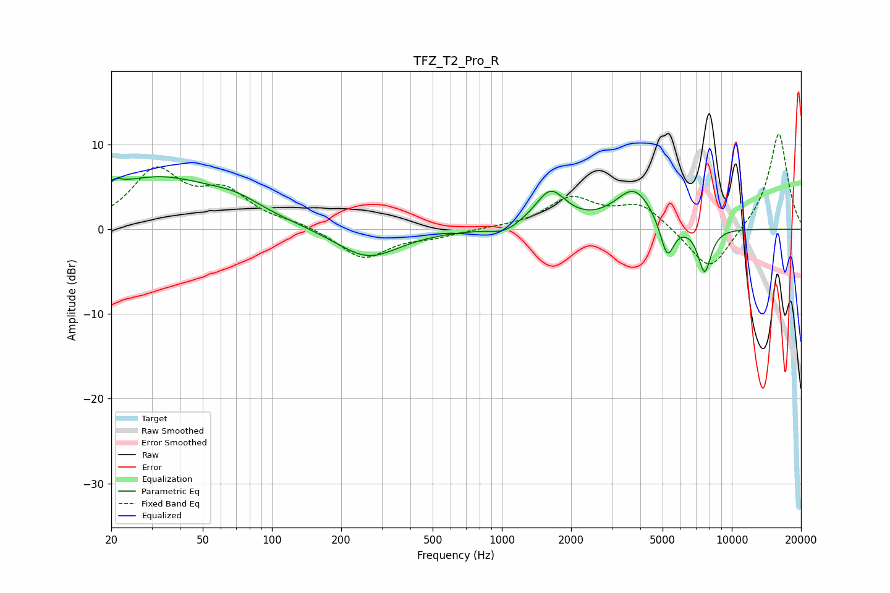

# TFZ_T2_Pro_R
See [usage instructions](https://github.com/jaakkopasanen/AutoEq#usage) for more options and info.

### Parametric EQs
Apply preamp of -6.3 dB when using parametric equalizer.

|   # | Type    |   Fc (Hz) |    Q |   Gain (dB) |
|-----|---------|-----------|------|-------------|
|   1 | Peaking |        20 | 5.99 |        -2.6 |
|   2 | Peaking |        20 | 5.21 |         3.2 |
|   3 | Peaking |        32 | 0.49 |         6   |
|   4 | Peaking |        70 | 1.32 |         1.2 |
|   5 | Peaking |       261 | 1.03 |        -3.5 |
|   6 | Peaking |      1026 | 2.34 |        -0.9 |
|   7 | Peaking |      1627 | 2.09 |         4.3 |
|   8 | Peaking |      3762 | 1.67 |         4.7 |
|   9 | Peaking |      5239 | 4.6  |        -4.5 |
|  10 | Peaking |      7614 | 4.61 |        -5.3 |

### Fixed Band EQs
When using fixed band (also called graphic) equalizer, apply preamp of **-11.3 dB** (if available) and set gains manually with these parameters.

|   # | Type    |   Fc (Hz) |    Q |   Gain (dB) |
|-----|---------|-----------|------|-------------|
|   1 | Peaking |        31 | 1.41 |         6.6 |
|   2 | Peaking |        62 | 1.41 |         3.9 |
|   3 | Peaking |       125 | 1.41 |         0.6 |
|   4 | Peaking |       250 | 1.41 |        -3.5 |
|   5 | Peaking |       500 | 1.41 |        -0.7 |
|   6 | Peaking |      1000 | 1.41 |         0.1 |
|   7 | Peaking |      2000 | 1.41 |         3.5 |
|   8 | Peaking |      4000 | 1.41 |         2.9 |
|   9 | Peaking |      8000 | 1.41 |        -5.3 |
|  10 | Peaking |     16000 | 1.41 |        11.5 |

### Graphs

