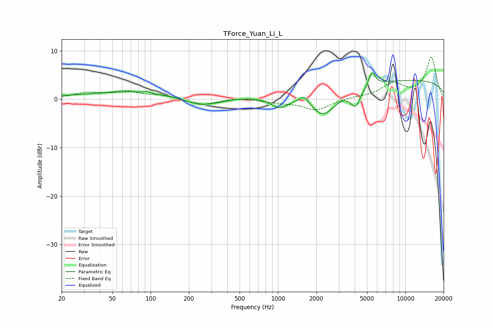

# TForce_Yuan_Li_L
See [usage instructions](https://github.com/jaakkopasanen/AutoEq#usage) for more options and info.

### Parametric EQs
Apply preamp of -5.6 dB when using parametric equalizer.

|   # | Type    |   Fc (Hz) |    Q |   Gain (dB) |
|-----|---------|-----------|------|-------------|
|   1 | Peaking |        68 | 2.13 |         0.3 |
|   2 | Peaking |        94 | 5.24 |         0.3 |
|   3 | Peaking |       120 | 0.18 |         1.6 |
|   4 | Peaking |       258 | 0.87 |        -2.5 |
|   5 | Peaking |      1024 | 2.15 |        -2.1 |
|   6 | Peaking |      1609 | 3.82 |         1.6 |
|   7 | Peaking |      2272 | 1.46 |        -5.1 |
|   8 | Peaking |      4056 | 3.43 |        -3.7 |
|   9 | Peaking |      5466 | 5.64 |         3   |
|  10 | Peaking |     10000 | 0.18 |         4   |

### Fixed Band EQs
When using fixed band (also called graphic) equalizer, apply preamp of **-8.8 dB** (if available) and set gains manually with these parameters.

|   # | Type    |   Fc (Hz) |    Q |   Gain (dB) |
|-----|---------|-----------|------|-------------|
|   1 | Peaking |        31 | 1.41 |         1.2 |
|   2 | Peaking |        62 | 1.41 |         1.5 |
|   3 | Peaking |       125 | 1.41 |         0.8 |
|   4 | Peaking |       250 | 1.41 |        -1.3 |
|   5 | Peaking |       500 | 1.41 |         0.3 |
|   6 | Peaking |      1000 | 1.41 |        -0.6 |
|   7 | Peaking |      2000 | 1.41 |        -2.2 |
|   8 | Peaking |      4000 | 1.41 |         0.4 |
|   9 | Peaking |      8000 | 1.41 |         3   |
|  10 | Peaking |     16000 | 1.41 |         8.6 |

### Graphs

