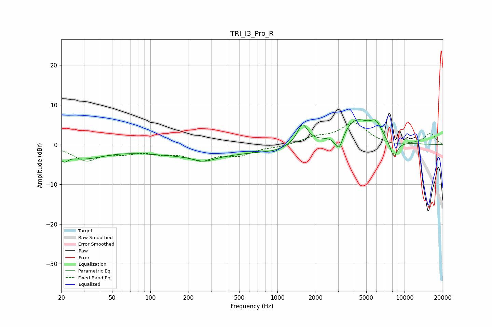

# TRI_I3_Pro_R
See [usage instructions](https://github.com/jaakkopasanen/AutoEq#usage) for more options and info.

### Parametric EQs
Apply preamp of -6.4 dB when using parametric equalizer.

|   # | Type    |   Fc (Hz) |    Q |   Gain (dB) |
|-----|---------|-----------|------|-------------|
|   1 | Peaking |        21 | 4.87 |        -1.9 |
|   2 | Peaking |        30 | 0.84 |        -3.1 |
|   3 | Peaking |       252 | 0.29 |        -2.7 |
|   4 | Peaking |       264 | 1.75 |        -1.4 |
|   5 | Peaking |       948 | 1.62 |        -0.6 |
|   6 | Peaking |      1574 | 3.45 |         5.1 |
|   7 | Peaking |      3048 | 4.24 |        -4.6 |
|   8 | Peaking |      4131 | 1.17 |         6.4 |
|   9 | Peaking |      5965 | 3.01 |         3.3 |
|  10 | Peaking |      8226 | 4.15 |        -4.5 |

### Fixed Band EQs
When using fixed band (also called graphic) equalizer, apply preamp of **-5.6 dB** (if available) and set gains manually with these parameters.

|   # | Type    |   Fc (Hz) |    Q |   Gain (dB) |
|-----|---------|-----------|------|-------------|
|   1 | Peaking |        31 | 1.41 |        -3.8 |
|   2 | Peaking |        62 | 1.41 |        -1.6 |
|   3 | Peaking |       125 | 1.41 |        -1.7 |
|   4 | Peaking |       250 | 1.41 |        -3.4 |
|   5 | Peaking |       500 | 1.41 |        -2.3 |
|   6 | Peaking |      1000 | 1.41 |        -0.5 |
|   7 | Peaking |      2000 | 1.41 |         1.6 |
|   8 | Peaking |      4000 | 1.41 |         5.3 |
|   9 | Peaking |      8000 | 1.41 |        -0.5 |
|  10 | Peaking |     16000 | 1.41 |         2.9 |

### Graphs

