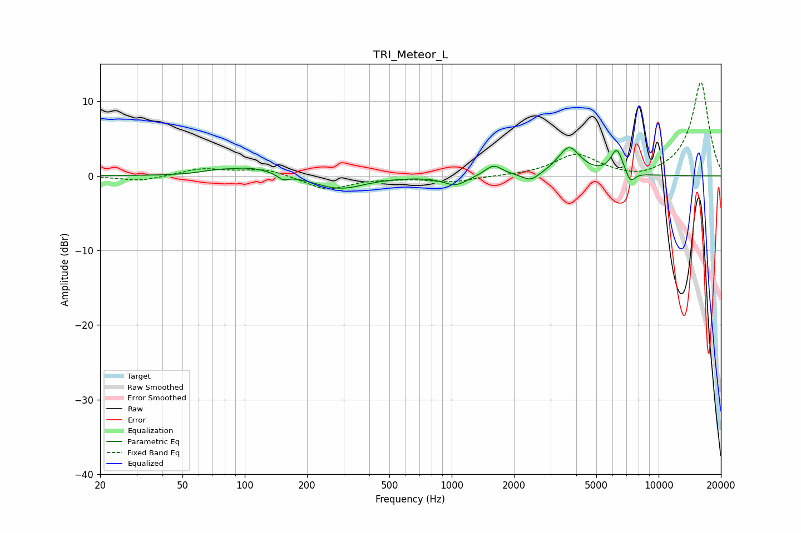

# TRI_Meteor_L
See [usage instructions](https://github.com/jaakkopasanen/AutoEq#usage) for more options and info.

### Parametric EQs
Apply preamp of -3.9 dB when using parametric equalizer.

|   # | Type    |   Fc (Hz) |    Q |   Gain (dB) |
|-----|---------|-----------|------|-------------|
|   1 | Peaking |        71 | 2.29 |         0.3 |
|   2 | Peaking |       106 | 1.17 |         1.2 |
|   3 | Peaking |       153 | 5.74 |        -0.7 |
|   4 | Peaking |       286 | 1.18 |        -1.8 |
|   5 | Peaking |      1043 | 2.53 |        -1.3 |
|   6 | Peaking |      1591 | 3.34 |         1.5 |
|   7 | Peaking |      2412 | 3.53 |        -1.1 |
|   8 | Peaking |      3692 | 2.61 |         3.8 |
|   9 | Peaking |      6285 | 4.68 |         3.4 |
|  10 | Peaking |      7301 | 6    |        -1.6 |

### Fixed Band EQs
When using fixed band (also called graphic) equalizer, apply preamp of **-12.6 dB** (if available) and set gains manually with these parameters.

|   # | Type    |   Fc (Hz) |    Q |   Gain (dB) |
|-----|---------|-----------|------|-------------|
|   1 | Peaking |        31 | 1.41 |        -0.7 |
|   2 | Peaking |        62 | 1.41 |         1   |
|   3 | Peaking |       125 | 1.41 |         1   |
|   4 | Peaking |       250 | 1.41 |        -1.9 |
|   5 | Peaking |       500 | 1.41 |        -0.2 |
|   6 | Peaking |      1000 | 1.41 |        -0.8 |
|   7 | Peaking |      2000 | 1.41 |        -0   |
|   8 | Peaking |      4000 | 1.41 |         2.8 |
|   9 | Peaking |      8000 | 1.41 |        -0.6 |
|  10 | Peaking |     16000 | 1.41 |        12.6 |

### Graphs

