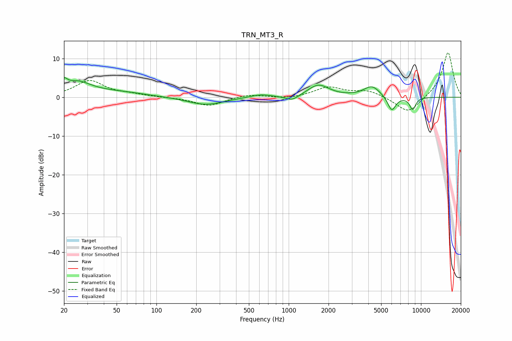

# TRN_MT3_R
See [usage instructions](https://github.com/jaakkopasanen/AutoEq#usage) for more options and info.

### Parametric EQs
Apply preamp of -5.1 dB when using parametric equalizer.

|   # | Type    |   Fc (Hz) |    Q |   Gain (dB) |
|-----|---------|-----------|------|-------------|
|   1 | Peaking |        20 | 5.92 |         2.1 |
|   2 | Peaking |        25 | 1.31 |         3.5 |
|   3 | Peaking |        52 | 0.68 |         1.1 |
|   4 | Peaking |       235 | 1.04 |        -2   |
|   5 | Peaking |       612 | 1.8  |         0.8 |
|   6 | Peaking |      1062 | 2.73 |        -1.4 |
|   7 | Peaking |      1675 | 1.75 |         3.2 |
|   8 | Peaking |      4254 | 2.27 |         2.8 |
|   9 | Peaking |      6012 | 4.43 |        -3.8 |
|  10 | Peaking |      8654 | 5.64 |        -3.1 |

### Fixed Band EQs
When using fixed band (also called graphic) equalizer, apply preamp of **-11.6 dB** (if available) and set gains manually with these parameters.

|   # | Type    |   Fc (Hz) |    Q |   Gain (dB) |
|-----|---------|-----------|------|-------------|
|   1 | Peaking |        31 | 1.41 |         4.2 |
|   2 | Peaking |        62 | 1.41 |         0.6 |
|   3 | Peaking |       125 | 1.41 |        -0.1 |
|   4 | Peaking |       250 | 1.41 |        -2.3 |
|   5 | Peaking |       500 | 1.41 |         0.8 |
|   6 | Peaking |      1000 | 1.41 |        -0.5 |
|   7 | Peaking |      2000 | 1.41 |         2.5 |
|   8 | Peaking |      4000 | 1.41 |         1.6 |
|   9 | Peaking |      8000 | 1.41 |        -4.3 |
|  10 | Peaking |     16000 | 1.41 |        11.8 |

### Graphs

