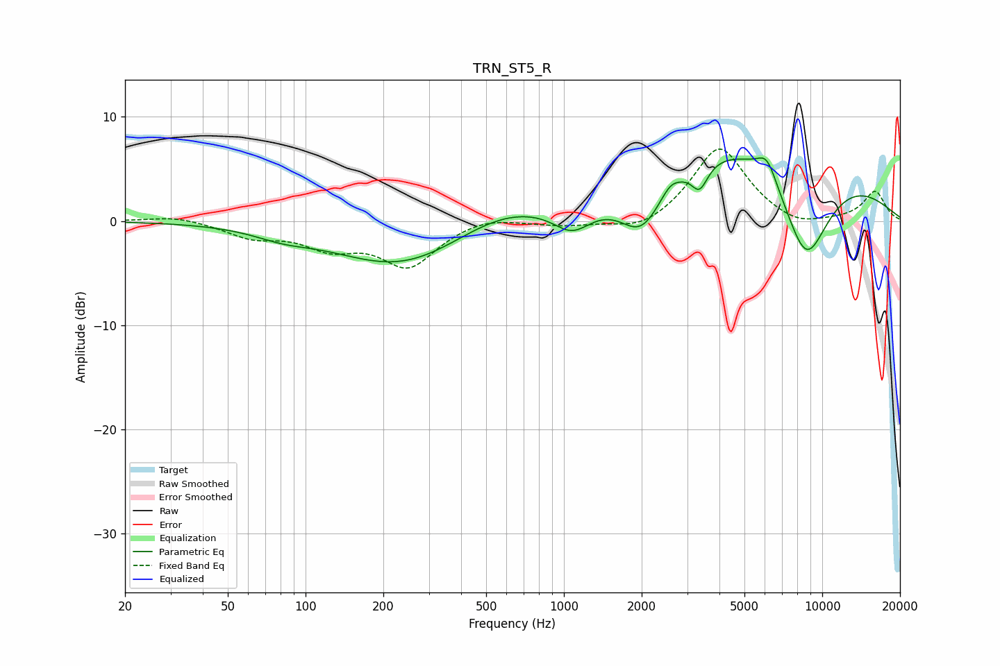

# TRN_ST5_R
See [usage instructions](https://github.com/jaakkopasanen/AutoEq#usage) for more options and info.

### Parametric EQs
Apply preamp of -6.1 dB when using parametric equalizer.

|   # | Type    |   Fc (Hz) |    Q |   Gain (dB) |
|-----|---------|-----------|------|-------------|
|   1 | Peaking |        82 | 1.28 |        -0.8 |
|   2 | Peaking |       238 | 0.54 |        -4.5 |
|   3 | Peaking |       565 | 0.71 |         1.9 |
|   4 | Peaking |      1078 | 1.86 |        -2.5 |
|   5 | Peaking |      1996 | 1.67 |        -4.8 |
|   6 | Peaking |      2577 | 4.46 |         0.8 |
|   7 | Peaking |      3353 | 4.44 |        -2.4 |
|   8 | Peaking |      6045 | 0.31 |         9.4 |
|   9 | Peaking |      6108 | 3.64 |         2.2 |
|  10 | Peaking |      8633 | 1.2  |       -11.4 |

### Fixed Band EQs
When using fixed band (also called graphic) equalizer, apply preamp of **-7.0 dB** (if available) and set gains manually with these parameters.

|   # | Type    |   Fc (Hz) |    Q |   Gain (dB) |
|-----|---------|-----------|------|-------------|
|   1 | Peaking |        31 | 1.41 |         0.5 |
|   2 | Peaking |        62 | 1.41 |        -1.4 |
|   3 | Peaking |       125 | 1.41 |        -2.2 |
|   4 | Peaking |       250 | 1.41 |        -4.2 |
|   5 | Peaking |       500 | 1.41 |         0.6 |
|   6 | Peaking |      1000 | 1.41 |        -0.5 |
|   7 | Peaking |      2000 | 1.41 |        -1.2 |
|   8 | Peaking |      4000 | 1.41 |         7.2 |
|   9 | Peaking |      8000 | 1.41 |        -0.9 |
|  10 | Peaking |     16000 | 1.41 |         2.8 |

### Graphs

