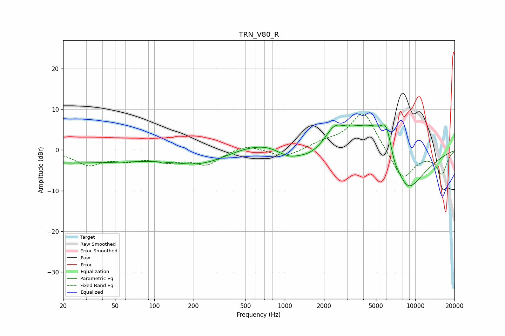

# TRN_V80_R
See [usage instructions](https://github.com/jaakkopasanen/AutoEq#usage) for more options and info.

### Parametric EQs
Apply preamp of -6.3 dB when using parametric equalizer.

|   # | Type    |   Fc (Hz) |    Q |   Gain (dB) |
|-----|---------|-----------|------|-------------|
|   1 | Peaking |        20 | 0.2  |        -3.1 |
|   2 | Peaking |       234 | 0.66 |        -3.6 |
|   3 | Peaking |      1054 | 1.44 |        -3.1 |
|   4 | Peaking |      1590 | 0.98 |        -5.7 |
|   5 | Peaking |      1876 | 0.27 |         5.7 |
|   6 | Peaking |      2397 | 2.2  |         3.1 |
|   7 | Peaking |      5142 | 0.81 |         6.9 |
|   8 | Peaking |      5985 | 3.66 |         5   |
|   9 | Peaking |      6970 | 4.17 |        -1.6 |
|  10 | Peaking |      8611 | 0.87 |       -13.9 |

### Fixed Band EQs
When using fixed band (also called graphic) equalizer, apply preamp of **-8.9 dB** (if available) and set gains manually with these parameters.

|   # | Type    |   Fc (Hz) |    Q |   Gain (dB) |
|-----|---------|-----------|------|-------------|
|   1 | Peaking |        31 | 1.41 |        -3.4 |
|   2 | Peaking |        62 | 1.41 |        -1.9 |
|   3 | Peaking |       125 | 1.41 |        -2.3 |
|   4 | Peaking |       250 | 1.41 |        -3.4 |
|   5 | Peaking |       500 | 1.41 |         1.5 |
|   6 | Peaking |      1000 | 1.41 |        -2   |
|   7 | Peaking |      2000 | 1.41 |         1.4 |
|   8 | Peaking |      4000 | 1.41 |         9.9 |
|   9 | Peaking |      8000 | 1.41 |        -7.7 |
|  10 | Peaking |     16000 | 1.41 |        -5.7 |

### Graphs

