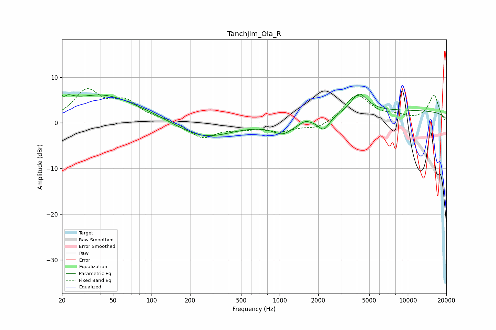

# Tanchjim_Ola_R
See [usage instructions](https://github.com/jaakkopasanen/AutoEq#usage) for more options and info.

### Parametric EQs
Apply preamp of -6.4 dB when using parametric equalizer.

|   # | Type    |   Fc (Hz) |    Q |   Gain (dB) |
|-----|---------|-----------|------|-------------|
|   1 | Peaking |        20 | 3.05 |         4.6 |
|   2 | Peaking |        21 | 5.91 |        -2.6 |
|   3 | Peaking |        42 | 0.39 |         5   |
|   4 | Peaking |        42 | 0.88 |         1.2 |
|   5 | Peaking |       253 | 0.67 |        -3.6 |
|   6 | Peaking |      1062 | 1.75 |        -2.5 |
|   7 | Peaking |      1578 | 3.7  |         0.7 |
|   8 | Peaking |      2208 | 3.23 |        -2.9 |
|   9 | Peaking |      4165 | 2.19 |         4.3 |
|  10 | Peaking |     10000 | 0.18 |         2.6 |

### Fixed Band EQs
When using fixed band (also called graphic) equalizer, apply preamp of **-7.6 dB** (if available) and set gains manually with these parameters.

|   # | Type    |   Fc (Hz) |    Q |   Gain (dB) |
|-----|---------|-----------|------|-------------|
|   1 | Peaking |        31 | 1.41 |         6.7 |
|   2 | Peaking |        62 | 1.41 |         4.1 |
|   3 | Peaking |       125 | 1.41 |         0.6 |
|   4 | Peaking |       250 | 1.41 |        -3.3 |
|   5 | Peaking |       500 | 1.41 |        -0.9 |
|   6 | Peaking |      1000 | 1.41 |        -1.7 |
|   7 | Peaking |      2000 | 1.41 |        -1.5 |
|   8 | Peaking |      4000 | 1.41 |         6.1 |
|   9 | Peaking |      8000 | 1.41 |         1.1 |
|  10 | Peaking |     16000 | 1.41 |         6   |

### Graphs

