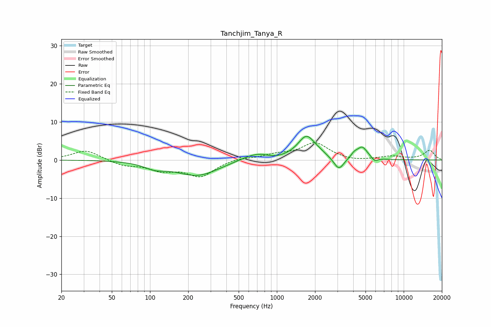

# Tanchjim_Tanya_R
See [usage instructions](https://github.com/jaakkopasanen/AutoEq#usage) for more options and info.

### Parametric EQs
Apply preamp of -6.3 dB when using parametric equalizer.

|   # | Type    |   Fc (Hz) |    Q |   Gain (dB) |
|-----|---------|-----------|------|-------------|
|   1 | Peaking |       109 | 1.68 |        -1.5 |
|   2 | Peaking |       236 | 0.84 |        -4.1 |
|   3 | Peaking |       700 | 1.19 |         2.1 |
|   4 | Peaking |       953 | 1.97 |        -0.7 |
|   5 | Peaking |      1716 | 2.04 |         6.1 |
|   6 | Peaking |      2218 | 3.36 |         0.4 |
|   7 | Peaking |      3081 | 3.6  |        -3.3 |
|   8 | Peaking |      4077 | 5.47 |         1.1 |
|   9 | Peaking |      4707 | 3.42 |         3.2 |
|  10 | Peaking |      5921 | 6    |        -1   |

### Fixed Band EQs
When using fixed band (also called graphic) equalizer, apply preamp of **-4.6 dB** (if available) and set gains manually with these parameters.

|   # | Type    |   Fc (Hz) |    Q |   Gain (dB) |
|-----|---------|-----------|------|-------------|
|   1 | Peaking |        31 | 1.41 |         2.6 |
|   2 | Peaking |        62 | 1.41 |        -1.4 |
|   3 | Peaking |       125 | 1.41 |        -2.4 |
|   4 | Peaking |       250 | 1.41 |        -4.1 |
|   5 | Peaking |       500 | 1.41 |         0.6 |
|   6 | Peaking |      1000 | 1.41 |         1.2 |
|   7 | Peaking |      2000 | 1.41 |         4.4 |
|   8 | Peaking |      4000 | 1.41 |        -0.5 |
|   9 | Peaking |      8000 | 1.41 |         0.9 |
|  10 | Peaking |     16000 | 1.41 |         2.5 |

### Graphs

