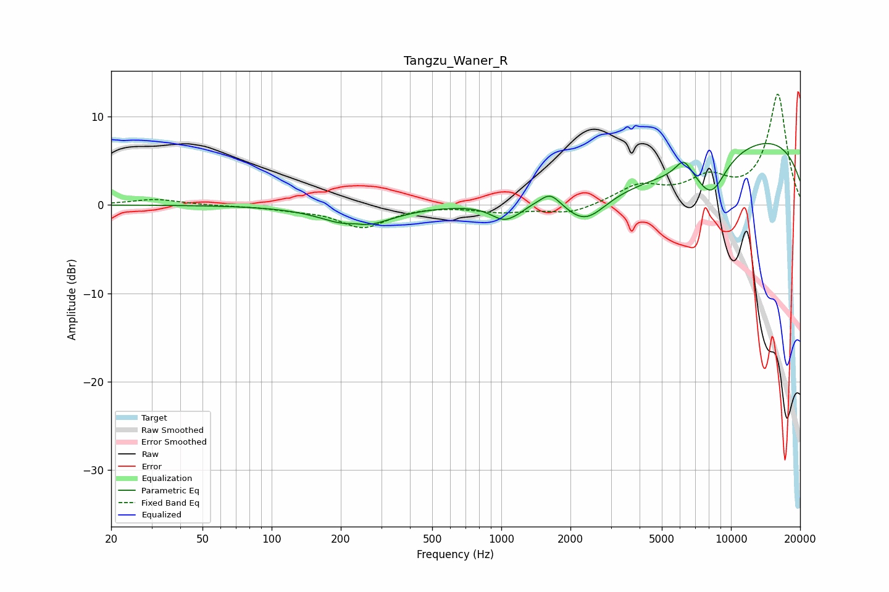

# Tangzu_Waner_R
See [usage instructions](https://github.com/jaakkopasanen/AutoEq#usage) for more options and info.

### Parametric EQs
Apply preamp of -7.1 dB when using parametric equalizer.

|   # | Type    |   Fc (Hz) |    Q |   Gain (dB) |
|-----|---------|-----------|------|-------------|
|   1 | Peaking |       230 | 3.4  |         0.4 |
|   2 | Peaking |       237 | 1.07 |        -2.6 |
|   3 | Peaking |      1035 | 2.34 |        -2   |
|   4 | Peaking |      1202 | 5.03 |        -0.2 |
|   5 | Peaking |      1636 | 3.27 |         1.5 |
|   6 | Peaking |      2321 | 1.55 |        -3.3 |
|   7 | Peaking |      4504 | 0.4  |        -4.2 |
|   8 | Peaking |      6228 | 3.8  |         2   |
|   9 | Peaking |      8200 | 1.96 |        -4.2 |
|  10 | Peaking |      9543 | 0.19 |         8.9 |

### Fixed Band EQs
When using fixed band (also called graphic) equalizer, apply preamp of **-12.6 dB** (if available) and set gains manually with these parameters.

|   # | Type    |   Fc (Hz) |    Q |   Gain (dB) |
|-----|---------|-----------|------|-------------|
|   1 | Peaking |        31 | 1.41 |         0.7 |
|   2 | Peaking |        62 | 1.41 |        -0.1 |
|   3 | Peaking |       125 | 1.41 |        -0.4 |
|   4 | Peaking |       250 | 1.41 |        -2.5 |
|   5 | Peaking |       500 | 1.41 |         0   |
|   6 | Peaking |      1000 | 1.41 |        -0.7 |
|   7 | Peaking |      2000 | 1.41 |        -1   |
|   8 | Peaking |      4000 | 1.41 |         2.1 |
|   9 | Peaking |      8000 | 1.41 |         2.6 |
|  10 | Peaking |     16000 | 1.41 |        12.5 |

### Graphs

