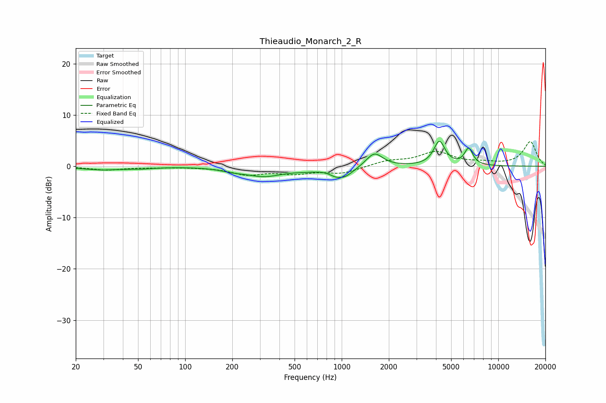

# Thieaudio_Monarch_2_R
See [usage instructions](https://github.com/jaakkopasanen/AutoEq#usage) for more options and info.

### Parametric EQs
Apply preamp of -5.0 dB when using parametric equalizer.

|   # | Type    |   Fc (Hz) |    Q |   Gain (dB) |
|-----|---------|-----------|------|-------------|
|   1 | Peaking |        29 | 1.1  |        -0.6 |
|   2 | Peaking |        53 | 1.54 |        -0.3 |
|   3 | Peaking |       200 | 1.89 |        -0.5 |
|   4 | Peaking |       319 | 1.15 |        -1.8 |
|   5 | Peaking |       595 | 1.56 |        -0.4 |
|   6 | Peaking |       903 | 4.3  |        -0.5 |
|   7 | Peaking |      1033 | 2.28 |        -2   |
|   8 | Peaking |      1616 | 2.71 |         2.8 |
|   9 | Peaking |      4206 | 3.94 |         4.7 |
|  10 | Peaking |      6470 | 5.08 |         3.2 |

### Fixed Band EQs
When using fixed band (also called graphic) equalizer, apply preamp of **-4.9 dB** (if available) and set gains manually with these parameters.

|   # | Type    |   Fc (Hz) |    Q |   Gain (dB) |
|-----|---------|-----------|------|-------------|
|   1 | Peaking |        31 | 1.41 |        -0.7 |
|   2 | Peaking |        62 | 1.41 |        -0.2 |
|   3 | Peaking |       125 | 1.41 |        -0.1 |
|   4 | Peaking |       250 | 1.41 |        -1.5 |
|   5 | Peaking |       500 | 1.41 |        -1.2 |
|   6 | Peaking |      1000 | 1.41 |        -1.3 |
|   7 | Peaking |      2000 | 1.41 |         1   |
|   8 | Peaking |      4000 | 1.41 |         2.6 |
|   9 | Peaking |      8000 | 1.41 |         0.5 |
|  10 | Peaking |     16000 | 1.41 |         4.8 |

### Graphs

