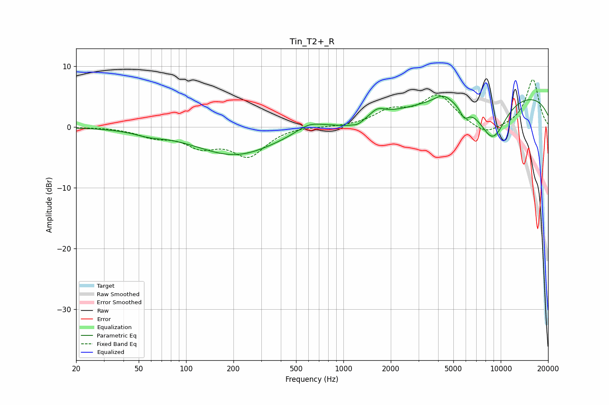

# Tin_T2+_R
See [usage instructions](https://github.com/jaakkopasanen/AutoEq#usage) for more options and info.

### Parametric EQs
Apply preamp of -5.2 dB when using parametric equalizer.

|   # | Type    |   Fc (Hz) |    Q |   Gain (dB) |
|-----|---------|-----------|------|-------------|
|   1 | Peaking |        58 | 1.53 |        -0.7 |
|   2 | Peaking |       205 | 0.55 |        -4.6 |
|   3 | Peaking |       608 | 1.69 |         1.5 |
|   4 | Peaking |      1027 | 3.01 |        -0.4 |
|   5 | Peaking |      1234 | 3.79 |        -0.8 |
|   6 | Peaking |      1650 | 3.03 |         1.3 |
|   7 | Peaking |      4289 | 2.6  |         1.4 |
|   8 | Peaking |      5866 | 5    |        -1.8 |
|   9 | Peaking |      8880 | 1.38 |        -7.4 |
|  10 | Peaking |     10000 | 0.19 |         5.9 |

### Fixed Band EQs
When using fixed band (also called graphic) equalizer, apply preamp of **-7.9 dB** (if available) and set gains manually with these parameters.

|   # | Type    |   Fc (Hz) |    Q |   Gain (dB) |
|-----|---------|-----------|------|-------------|
|   1 | Peaking |        31 | 1.41 |         0   |
|   2 | Peaking |        62 | 1.41 |        -1.4 |
|   3 | Peaking |       125 | 1.41 |        -2.8 |
|   4 | Peaking |       250 | 1.41 |        -4.5 |
|   5 | Peaking |       500 | 1.41 |         0.3 |
|   6 | Peaking |      1000 | 1.41 |        -0   |
|   7 | Peaking |      2000 | 1.41 |         2.4 |
|   8 | Peaking |      4000 | 1.41 |         5   |
|   9 | Peaking |      8000 | 1.41 |        -1.7 |
|  10 | Peaking |     16000 | 1.41 |         7.9 |

### Graphs

