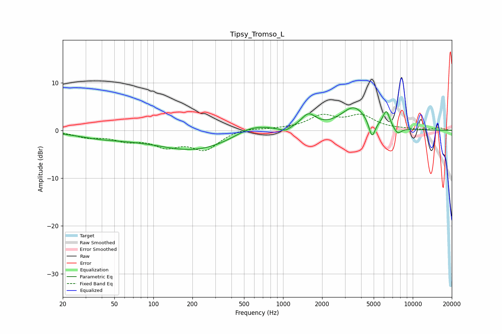

# Tipsy_Tromso_L
See [usage instructions](https://github.com/jaakkopasanen/AutoEq#usage) for more options and info.

### Parametric EQs
Apply preamp of -4.8 dB when using parametric equalizer.

|   # | Type    |   Fc (Hz) |    Q |   Gain (dB) |
|-----|---------|-----------|------|-------------|
|   1 | Peaking |        40 | 0.73 |        -1.3 |
|   2 | Peaking |        74 | 1.25 |        -0.1 |
|   3 | Peaking |       211 | 0.45 |        -4.2 |
|   4 | Peaking |       577 | 1    |         2.2 |
|   5 | Peaking |      1037 | 3.67 |        -0.8 |
|   6 | Peaking |      1569 | 2.51 |         2.9 |
|   7 | Peaking |      3522 | 1.4  |         4.8 |
|   8 | Peaking |      4851 | 5.8  |        -3.8 |
|   9 | Peaking |      6255 | 5.17 |         3.4 |
|  10 | Peaking |      7643 | 4.43 |        -1.4 |

### Fixed Band EQs
When using fixed band (also called graphic) equalizer, apply preamp of **-3.5 dB** (if available) and set gains manually with these parameters.

|   # | Type    |   Fc (Hz) |    Q |   Gain (dB) |
|-----|---------|-----------|------|-------------|
|   1 | Peaking |        31 | 1.41 |        -1.2 |
|   2 | Peaking |        62 | 1.41 |        -1.7 |
|   3 | Peaking |       125 | 1.41 |        -2.9 |
|   4 | Peaking |       250 | 1.41 |        -3.8 |
|   5 | Peaking |       500 | 1.41 |         0.6 |
|   6 | Peaking |      1000 | 1.41 |         0.2 |
|   7 | Peaking |      2000 | 1.41 |         2.8 |
|   8 | Peaking |      4000 | 1.41 |         2.9 |
|   9 | Peaking |      8000 | 1.41 |         0.2 |
|  10 | Peaking |     16000 | 1.41 |         0.5 |

### Graphs

