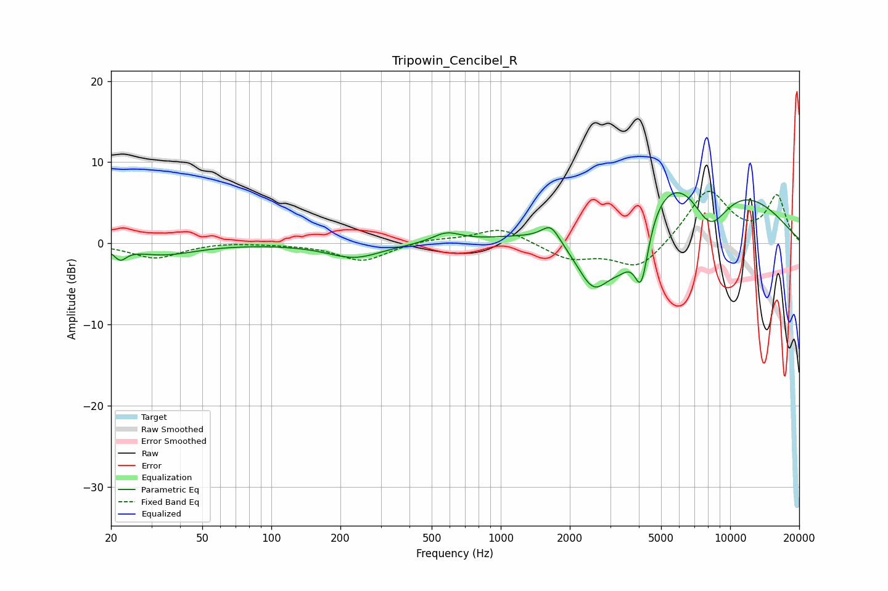

# Tripowin_Cencibel_R
See [usage instructions](https://github.com/jaakkopasanen/AutoEq#usage) for more options and info.

### Parametric EQs
Apply preamp of -6.3 dB when using parametric equalizer.

|   # | Type    |   Fc (Hz) |    Q |   Gain (dB) |
|-----|---------|-----------|------|-------------|
|   1 | Peaking |        22 | 5.46 |        -1.3 |
|   2 | Peaking |        34 | 1.02 |        -1.4 |
|   3 | Peaking |       231 | 1.19 |        -1.8 |
|   4 | Peaking |       580 | 2.38 |         1.2 |
|   5 | Peaking |      1653 | 3.65 |         2.1 |
|   6 | Peaking |      2550 | 1.54 |        -9.2 |
|   7 | Peaking |      3365 | 2.12 |        -4.2 |
|   8 | Peaking |      4101 | 4.17 |        -8.2 |
|   9 | Peaking |      6786 | 0.42 |        13.4 |
|  10 | Peaking |      8127 | 1.28 |        -9.3 |

### Fixed Band EQs
When using fixed band (also called graphic) equalizer, apply preamp of **-6.5 dB** (if available) and set gains manually with these parameters.

|   # | Type    |   Fc (Hz) |    Q |   Gain (dB) |
|-----|---------|-----------|------|-------------|
|   1 | Peaking |        31 | 1.41 |        -1.8 |
|   2 | Peaking |        62 | 1.41 |         0.2 |
|   3 | Peaking |       125 | 1.41 |        -0.1 |
|   4 | Peaking |       250 | 1.41 |        -2.2 |
|   5 | Peaking |       500 | 1.41 |         0.5 |
|   6 | Peaking |      1000 | 1.41 |         2   |
|   7 | Peaking |      2000 | 1.41 |        -1.9 |
|   8 | Peaking |      4000 | 1.41 |        -3.4 |
|   9 | Peaking |      8000 | 1.41 |         6.6 |
|  10 | Peaking |     16000 | 1.41 |         5.7 |

### Graphs

