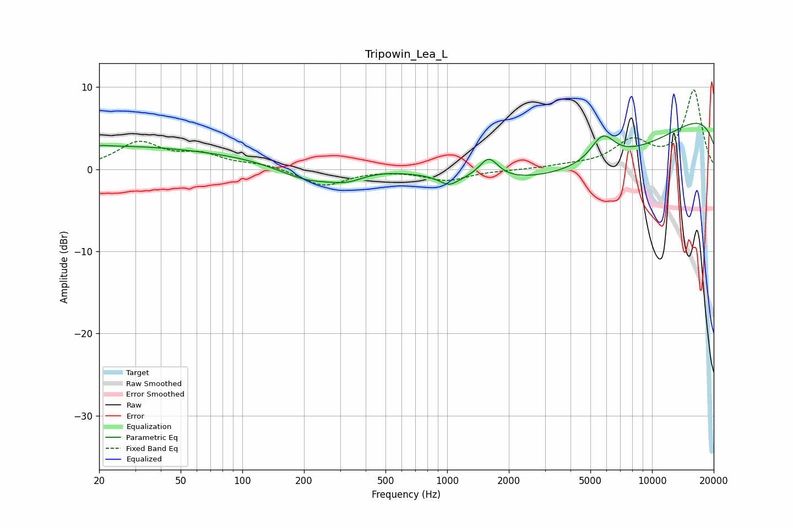

# Tripowin_Lea_L
See [usage instructions](https://github.com/jaakkopasanen/AutoEq#usage) for more options and info.

### Parametric EQs
Apply preamp of -5.7 dB when using parametric equalizer.

|   # | Type    |   Fc (Hz) |    Q |   Gain (dB) |
|-----|---------|-----------|------|-------------|
|   1 | Peaking |        20 | 0.31 |         2.6 |
|   2 | Peaking |        21 | 5.62 |         0.1 |
|   3 | Peaking |       169 | 0.32 |         1.4 |
|   4 | Peaking |       211 | 0.88 |        -2.5 |
|   5 | Peaking |       326 | 1.7  |        -1.1 |
|   6 | Peaking |      1020 | 3.06 |        -1.1 |
|   7 | Peaking |      1596 | 3.06 |         2.6 |
|   8 | Peaking |      5168 | 0.26 |        -8.3 |
|   9 | Peaking |      5743 | 2.34 |         3.2 |
|  10 | Peaking |     10000 | 0.18 |         9.8 |

### Fixed Band EQs
When using fixed band (also called graphic) equalizer, apply preamp of **-9.7 dB** (if available) and set gains manually with these parameters.

|   # | Type    |   Fc (Hz) |    Q |   Gain (dB) |
|-----|---------|-----------|------|-------------|
|   1 | Peaking |        31 | 1.41 |         3.1 |
|   2 | Peaking |        62 | 1.41 |         1.5 |
|   3 | Peaking |       125 | 1.41 |         0.6 |
|   4 | Peaking |       250 | 1.41 |        -2.1 |
|   5 | Peaking |       500 | 1.41 |         0   |
|   6 | Peaking |      1000 | 1.41 |        -1.3 |
|   7 | Peaking |      2000 | 1.41 |        -0.1 |
|   8 | Peaking |      4000 | 1.41 |         0.3 |
|   9 | Peaking |      8000 | 1.41 |         3.2 |
|  10 | Peaking |     16000 | 1.41 |         9.5 |

### Graphs

