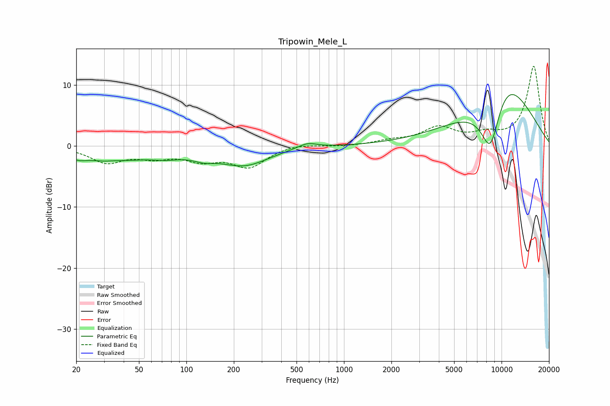

# Tripowin_Mele_L
See [usage instructions](https://github.com/jaakkopasanen/AutoEq#usage) for more options and info.

### Parametric EQs
Apply preamp of -8.5 dB when using parametric equalizer.

|   # | Type    |   Fc (Hz) |    Q |   Gain (dB) |
|-----|---------|-----------|------|-------------|
|   1 | Peaking |        21 | 5.21 |        -0.2 |
|   2 | Peaking |        30 | 0.39 |        -2.3 |
|   3 | Peaking |        30 | 5.85 |        -0.1 |
|   4 | Peaking |        75 | 1.8  |        -0.5 |
|   5 | Peaking |       129 | 2.07 |        -0.8 |
|   6 | Peaking |       234 | 0.91 |        -2.9 |
|   7 | Peaking |       559 | 2.92 |        -0.7 |
|   8 | Peaking |       572 | 2.44 |         1.6 |
|   9 | Peaking |      8507 | 1.75 |       -11.3 |
|  10 | Peaking |     10000 | 0.6  |        13   |

### Fixed Band EQs
When using fixed band (also called graphic) equalizer, apply preamp of **-13.2 dB** (if available) and set gains manually with these parameters.

|   # | Type    |   Fc (Hz) |    Q |   Gain (dB) |
|-----|---------|-----------|------|-------------|
|   1 | Peaking |        31 | 1.41 |        -2.5 |
|   2 | Peaking |        62 | 1.41 |        -1.5 |
|   3 | Peaking |       125 | 1.41 |        -2   |
|   4 | Peaking |       250 | 1.41 |        -3.3 |
|   5 | Peaking |       500 | 1.41 |         0.5 |
|   6 | Peaking |      1000 | 1.41 |        -0.1 |
|   7 | Peaking |      2000 | 1.41 |         0.7 |
|   8 | Peaking |      4000 | 1.41 |         2.8 |
|   9 | Peaking |      8000 | 1.41 |         1.5 |
|  10 | Peaking |     16000 | 1.41 |        13.1 |

### Graphs

