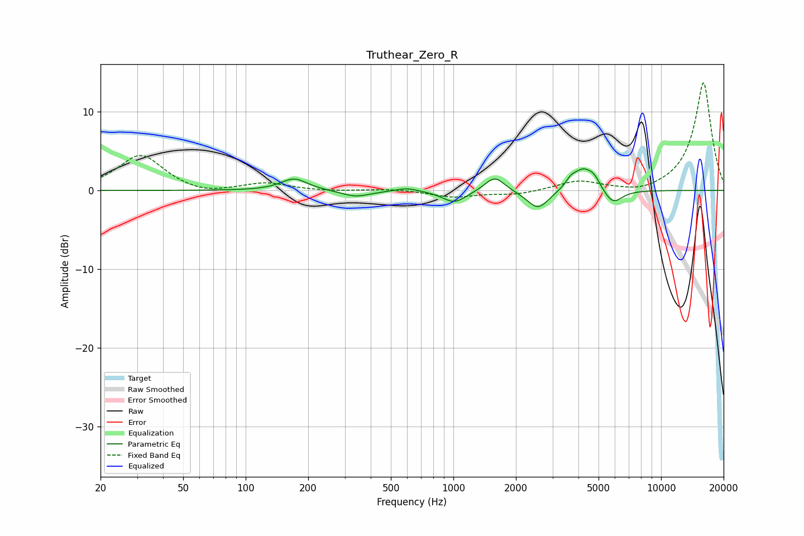

# Truthear_Zero_R
See [usage instructions](https://github.com/jaakkopasanen/AutoEq#usage) for more options and info.

### Parametric EQs
Apply preamp of -2.8 dB when using parametric equalizer.

|   # | Type    |   Fc (Hz) |    Q |   Gain (dB) |
|-----|---------|-----------|------|-------------|
|   1 | Peaking |       171 | 2.25 |         1.5 |
|   2 | Peaking |       339 | 1.99 |        -0.8 |
|   3 | Peaking |       597 | 2.68 |         0.4 |
|   4 | Peaking |      1012 | 2.48 |        -1.6 |
|   5 | Peaking |      1581 | 3.01 |         1.9 |
|   6 | Peaking |      2557 | 2.67 |        -2.5 |
|   7 | Peaking |      3677 | 5.78 |         0.8 |
|   8 | Peaking |      4214 | 2.8  |         2.7 |
|   9 | Peaking |      4775 | 4.72 |         1   |
|  10 | Peaking |      5855 | 3.07 |        -1.9 |

### Fixed Band EQs
When using fixed band (also called graphic) equalizer, apply preamp of **-13.8 dB** (if available) and set gains manually with these parameters.

|   # | Type    |   Fc (Hz) |    Q |   Gain (dB) |
|-----|---------|-----------|------|-------------|
|   1 | Peaking |        31 | 1.41 |         4.5 |
|   2 | Peaking |        62 | 1.41 |        -0.7 |
|   3 | Peaking |       125 | 1.41 |         0.9 |
|   4 | Peaking |       250 | 1.41 |        -0.1 |
|   5 | Peaking |       500 | 1.41 |         0.2 |
|   6 | Peaking |      1000 | 1.41 |        -0.8 |
|   7 | Peaking |      2000 | 1.41 |        -0.5 |
|   8 | Peaking |      4000 | 1.41 |         1.2 |
|   9 | Peaking |      8000 | 1.41 |        -0.6 |
|  10 | Peaking |     16000 | 1.41 |        13.8 |

### Graphs

