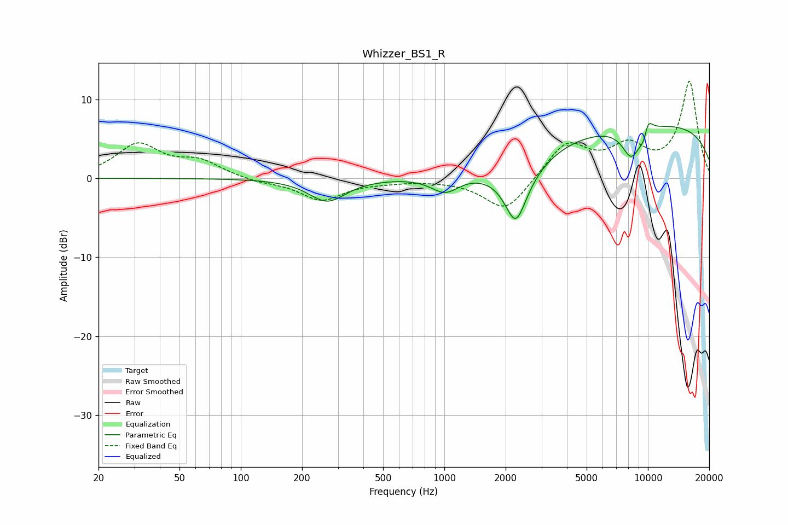

# Whizzer_BS1_R
See [usage instructions](https://github.com/jaakkopasanen/AutoEq#usage) for more options and info.

### Parametric EQs
Apply preamp of -7.1 dB when using parametric equalizer.

|   # | Type    |   Fc (Hz) |    Q |   Gain (dB) |
|-----|---------|-----------|------|-------------|
|   1 | Peaking |       266 | 1.57 |        -2.9 |
|   2 | Peaking |      1009 | 2.03 |        -2.2 |
|   3 | Peaking |      2244 | 2.78 |        -5.8 |
|   4 | Peaking |      2332 | 1.1  |        -2.6 |
|   5 | Peaking |      8174 | 4.16 |        -0.5 |
|   6 | Peaking |      8322 | 2.6  |        -3.4 |
|   7 | Peaking |      8987 | 3.85 |        -0.2 |
|   8 | Peaking |      9623 | 5.77 |        -2.5 |
|   9 | Peaking |      9880 | 4.94 |         3.2 |
|  10 | Peaking |     10000 | 0.19 |         7   |

### Fixed Band EQs
When using fixed band (also called graphic) equalizer, apply preamp of **-12.4 dB** (if available) and set gains manually with these parameters.

|   # | Type    |   Fc (Hz) |    Q |   Gain (dB) |
|-----|---------|-----------|------|-------------|
|   1 | Peaking |        31 | 1.41 |         4.2 |
|   2 | Peaking |        62 | 1.41 |         2   |
|   3 | Peaking |       125 | 1.41 |        -0.5 |
|   4 | Peaking |       250 | 1.41 |        -2.7 |
|   5 | Peaking |       500 | 1.41 |        -0.3 |
|   6 | Peaking |      1000 | 1.41 |        -0.1 |
|   7 | Peaking |      2000 | 1.41 |        -4.3 |
|   8 | Peaking |      4000 | 1.41 |         4.5 |
|   9 | Peaking |      8000 | 1.41 |         3.5 |
|  10 | Peaking |     16000 | 1.41 |        12.2 |

### Graphs

