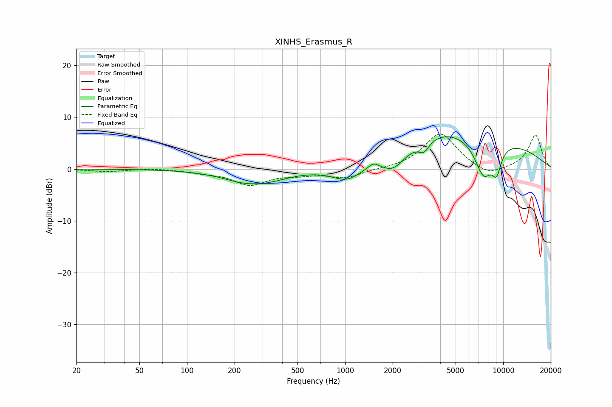

# XINHS_Erasmus_R
See [usage instructions](https://github.com/jaakkopasanen/AutoEq#usage) for more options and info.

### Parametric EQs
Apply preamp of -6.3 dB when using parametric equalizer.

|   # | Type    |   Fc (Hz) |    Q |   Gain (dB) |
|-----|---------|-----------|------|-------------|
|   1 | Peaking |       268 | 0.88 |        -3.4 |
|   2 | Peaking |       271 | 1.84 |         0.5 |
|   3 | Peaking |      1031 | 1.49 |        -2.9 |
|   4 | Peaking |      1510 | 4.59 |         1   |
|   5 | Peaking |      2016 | 1.92 |        -3.2 |
|   6 | Peaking |      3152 | 4.34 |        -2   |
|   7 | Peaking |      4109 | 0.81 |         1.8 |
|   8 | Peaking |      6518 | 0.28 |         6.2 |
|   9 | Peaking |      7513 | 2.27 |        -7.3 |
|  10 | Peaking |      9079 | 4.2  |        -4.5 |

### Fixed Band EQs
When using fixed band (also called graphic) equalizer, apply preamp of **-6.8 dB** (if available) and set gains manually with these parameters.

|   # | Type    |   Fc (Hz) |    Q |   Gain (dB) |
|-----|---------|-----------|------|-------------|
|   1 | Peaking |        31 | 1.41 |        -0.5 |
|   2 | Peaking |        62 | 1.41 |         0.2 |
|   3 | Peaking |       125 | 1.41 |        -0.5 |
|   4 | Peaking |       250 | 1.41 |        -2.9 |
|   5 | Peaking |       500 | 1.41 |        -0.8 |
|   6 | Peaking |      1000 | 1.41 |        -1.6 |
|   7 | Peaking |      2000 | 1.41 |        -0.1 |
|   8 | Peaking |      4000 | 1.41 |         7   |
|   9 | Peaking |      8000 | 1.41 |        -1.6 |
|  10 | Peaking |     16000 | 1.41 |         6.6 |

### Graphs

